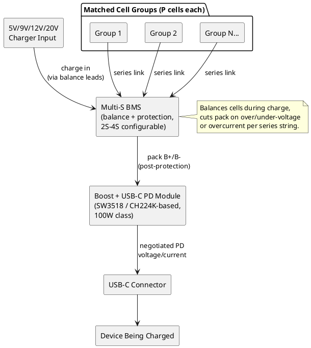

# Reclaimed-Cell USB-C PD Pack

Reusing salvaged/old power bank 18650 cells to build a multi-cell pack with real USB-C PD output.

## Overview

Old power banks and laptop packs accumulate cells of unknown remaining capacity and health.
Rather than discard them, this project sorts and matches cells by actual (tested) capacity and
internal resistance, groups them into a series/parallel (S/P) pack, and drives a USB-C PD boost
module so the finished pack can fast-charge phones, laptops, and other PD-capable devices instead
of only offering a fixed 5V USB-A output like a stock power bank.

The core risk in any DIY series pack is mismatched cells — different capacity or internal
resistance per cell in a series string causes uneven charge/discharge and accelerates failure
(and is a safety issue). This project treats cell sorting as its own gated phase before any pack
wiring decisions are made.

**Key goals:**
- Test and sort a pile of pulled/salvaged cells by real mAh and mΩ, not printed ratings
- Land on a matched S/P layout (2S-4S depending on how many good matched groups exist)
- Assemble a BMS-protected pack driving a 100W-class USB-C PD boost module
- Verify finished pack negotiates PD correctly and holds up under load

## Materials

See [parts-list.md](parts-list.md) for the full shopping list (boards/ICs, cell testing gear,
battery assembly supplies, wiring, and test equipment).

**Key gap:** no programmable DC electronic load currently on hand — needed both for individual
cell discharge testing (capacity/IR) and later for load-testing the finished pack's PD output.
See [Test Equipment inventory](../../.personal/incoming/test-equipment.md) for what's already
available (multimeter, bench supplies).

## Construction Method / Build Steps

1. **Sort and match cells** (gating step — do not skip):
   - Discharge test each cell individually for real capacity (mAh) and internal resistance (mΩ)
   - Group cells into matched sets (~5% capacity spread, similar IR)
   - Discard any cell with high IR, swelling, or capacity below ~70% of rated spec
2. **Decide S/P layout** from matched group count and target PD voltage/wattage:
   - 2S (7.4V nominal) — fine for 5V/9V PD, modest power
   - 3S (11.1V nominal) — good middle ground
   - 4S (14.8V nominal) — needed to comfortably hit real 20V PD at higher wattage
3. **Assemble pack** — spot weld matched groups into series/parallel bank, wire to multi-S BMS
   balance leads, insulate between groups (fish paper, Kapton)
4. **Integrate PD module** — connect BMS pack output (post-protection) to SW3518/CH224K-based
   boost + PD module, verify negotiation with a standalone USB-C PD trigger board before final
   assembly
5. **Load test** — verify output voltage/current under real load with the electronic load, confirm
   no excessive voltage sag or thermal issues

## Key Features

- Real capacity/IR-based cell sorting instead of trusting printed ratings or reused cells blindly
- Multi-S BMS provides balancing and per-string over/under-voltage and overcurrent protection
- SW3518/CH224K-based module outputs real negotiated USB-C PD (5V/9V/12V/20V) instead of fixed 5V
- Flexible 2S-4S component choices until final cell yield is known, narrowing to exact parts once
  S/P layout is fixed

## Advantages Over Commercial/Alternative Solutions

| Feature | This Project | Stock Power Bank Reuse |
|---------|-------------|-------------------------|
| Output | Real negotiated USB-C PD (up to 20V, 100W-class module) | Fixed 5V USB-A only |
| Cell health | Individually tested and matched | Unknown, as-is from donor pack |
| Protection | Dedicated multi-S BMS with balancing | Often minimal/no balancing on cheap banks |
| Capacity | Only what actually tests good | Whatever's left in a failing pack |

## Use Cases

- High-wattage USB-C PD power bank for laptops/phones from otherwise-scrapped cells
- Bench reference for testing PD trigger negotiation on other projects
- Practical application of the electronic load once acquired (also useful for future battery/PSU
  projects)

## Project Status

**Status:** Planning

**Next Steps:**
1. Acquire electronic load (e.g. ATORCH DL24/DL24P) — key gap blocking all cell testing
2. Discharge-test and sort accumulated salvaged cells (capacity + IR)
3. Decide final S/P layout from matched group yield
4. Order exact BMS and boost module part numbers for the chosen S count
5. Spot weld, assemble, and balance-charge the pack
6. Verify PD negotiation and load-test finished output

## References

- Block diagram: see above (embedded PlantUML)
- Cross-reference: [Test Equipment inventory](../../.personal/incoming/test-equipment.md) (existing multimeter, bench supplies)
- Cross-reference: [tools-and-components.md](../../tools-and-components.md) (wire, heat shrink, general assembly stock)

---

*Last updated: 2026-07-22*
