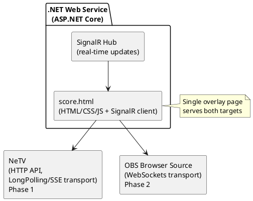
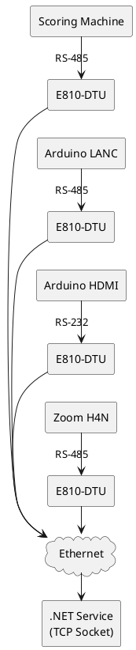

# ScoreMachine - Distributed Fencing Tournament Scoring System

**Status**: Production (2018-Present) | **Type**: Distributed Systems / A/V Integration / Embedded

---

## Overview

Complete distributed fencing tournament scoring system with real-time overlay, multi-protocol support, and network-based A/V control. Deployed at **Arnold Fencing Classic 2018-2020** (major international tournament, part of Arnold Sports Festival) and still in production use today.

**Key Achievement:** Network-distributed A/V system with multi-target overlay abstraction (hardware FPGA + software OBS) using single web page, enabling seamless migration from hardware-first to software-first architecture as technology matured.

**Critical Innovation:** **Multi-target overlay architecture** with single HTML/CSS/JS page served to both NeTV hardware FPGA overlay (with SignalR transport fallback for browser limitations) AND OBS Browser Source (WebSockets), allowing production deployment on hardware when software couldn't handle 1080p real-time overlay, then migration to pure software as OBS performance improved - **without rewriting overlay code**.

**Production Deployment:**
- **Arnold Fencing Classic** (2018-2020) - Major international fencing tournament
- Part of Arnold Sports Festival (Columbus, Ohio)
- Professional broadcast/streaming requirements
- **Royal Arts Fencing Academy** (2020-present) - Continued using OBS version
- **Still in production use** (OBS version) at Royal Arts events (2026)

---

## Documentation Index

### Implementation Phases

| Phase | Period | Platform | Status | Documentation |
|:------|:-------|:---------|:-------|:--------------|
| **Phase 1** | 2017-2019 | Raspberry Pi 2 + NeTV FPGA | Historical | [phase1-raspberry-pi-netv.md](phase1-raspberry-pi-netv.md) |
| **Phase 2** | 2019-Present | Windows PC + OBS Studio | Production | [phase2-windows-obs.md](phase2-windows-obs.md) |

### Phase Comparison

| Feature | Phase 1 (Raspberry Pi + NeTV) | Phase 2 (Windows + OBS) |
|:--------|:------------------------------|:------------------------|
| **Overlay** | NeTV FPGA hardware overlay | OBS Browser Source (software) |
| **Platform** | Raspberry Pi 2 (ARM) | Windows 10+ PC |
| **Network** | Dual network (USB Ethernet + built-in) | Single network |
| **Devices** | 4× E810-DTU converters (scoring, camera, HDMI, audio) | 1× RS-485-to-USB (scoring only) |
| **A/V Control** | Distributed (Arduino LANC, HDMI switch, H4N) | Integrated in OBS (recording, switching, audio) |
| **Complexity** | High (custom hardware, network infrastructure) | Low (simplified, single PC) |
| **Transport** | SignalR LongPolling/SSE (NeTV browser limitation) | SignalR WebSockets |
| **Deployment** | Arnold 2018-2019 | Arnold 2019-2020, Royal Arts 2020-present |

---

## Quick Start

### Phase 2: OBS Version (Current Production)

```bash
# 1. Connect scoring machine via RS-485-to-USB
# 2. Start .NET scoring service
cd FencingScoreBoard/src/FencingScoreBoard.Web
dotnet run

# 3. Configure OBS Browser Source
# URL: http://localhost:5000/score.html
# Width: 1920, Height: 1080

# 4. Service auto-decodes scoring machine protocol (Favero/Saint George)
# 5. SignalR pushes real-time updates to OBS overlay
```

See [phase2-windows-obs.md](phase2-windows-obs.md) for complete setup guide.

### Phase 1: Raspberry Pi + NeTV (Historical)

```bash
# Raspberry Pi with dual Ethernet (external + internal networks)
# 4× Ebyte E810-DTU serial-to-TCP/IP converters
# .NET service connects to all devices via TCP sockets
# NeTV loads overlay via HTTP API with LongPolling transport
```

See [phase1-raspberry-pi-netv.md](phase1-raspberry-pi-netv.md) for complete architecture details.

---

## Source Code Repositories

| Repository | Components | Description |
|:-----------|:-----------|:------------|
| **[BinaryDataDecoders](https://github.com/mwwhited/BinaryDataDecoders)** | Protocol decoders | Favero + Saint George scoring machine protocol parsers (796K+ NuGet downloads) |
| **[FencingScoreBoard](https://github.com/mwwhited/FencingScoreBoard)** | Web service + overlay | ASP.NET Core + SignalR service, HTML/CSS/JS overlay page (current) |
| **[EmbeddedBakery](https://github.com/mwwhited/EmbeddedBakery)** | Arduino hardware | HDMI switch (IR), LANC camera, custom PCBs |
| **[proving-grounds/OoBDev.ScoreMachine](https://github.com/mwwhited/proving-grounds/tree/main/examples/OoBDev.ScoreMachine)** | Original prototype | Historical reference (2017-2018) - .NET Core 2.x, Phase 1 implementation |

---

## Key Technologies

### Protocols
- **Favero** - Italian manufacturer scoring protocol (RS-485, custom binary)
- **Saint George** - UK manufacturer scoring protocol (RS-485, custom binary)
- **LANC** - Sony/Canon camera control (RS-232 2400 baud 8n1)
- **RS-485** - Multi-drop serial bus for scoring machines and audio recorder

### Frameworks & Libraries
- **ASP.NET Core** - Web service framework
- **SignalR** - Real-time WebSocket/LongPolling communication
- **System.IO.Pipelines** - High-performance async stream parsing
- **OBS Studio** - Video production software (Phase 2)

### Hardware
- **NeTV FPGA** (Xilinx Spartan-6) - Hardware HDMI overlay (Phase 1)
- **Ebyte E810-DTU** - Serial-to-TCP/IP converters (Phase 1)
- **Arduino Uno/Mega** - HDMI switch and LANC camera control (Phase 1)
- **Raspberry Pi 2** - ARM host platform (Phase 1)

---

## Protocol Documentation

| Protocol | Location | Description |
|:---------|:---------|:------------|
| **Favero** | [favero-protocol.md](favero-protocol.md) | Complete Favero Full-Arm-05 serial protocol specification |
| **Saint George** | [BinaryDataDecoders](https://github.com/mwwhited/BinaryDataDecoders/tree/master/src/BinaryDataDecoders.ElectronicScoringMachines.Fencing/SaintGeorge) | Saint George protocol decoder |
| **LANC** | [EmbeddedBakery/notes](https://github.com/mwwhited/EmbeddedBakery/tree/master/notes) | LANC protocol notes and references |
| **Zoom H4N** | [proving-grounds/ZoomH4n.md](https://github.com/mwwhited/proving-grounds/blob/main/examples/OoBDev.ScoreMachine/ZoomH4n.md) | H4N remote protocol reverse engineering |

---

## Use Cases

### Tournament Streaming & Broadcast
- **Real-time Score Overlay** - Live scoring display on broadcast feed
- **Multi-Strip Tournaments** - Support for multiple simultaneous bouts
- **Professional Production** - Broadcast-quality graphics and timing
- **Commercial Loop Switching** - Automated switching to intermission content

### Distributed A/V Control (Phase 1)
- **Network-Based Control** - Ethernet infrastructure eliminates cable length limits
- **Camera Control** - Automated recording start/stop synchronized with bouts
- **Audio Recording** - Synchronized audio capture with bout events
- **Video Switching** - Automated HDMI input selection

### Hardware-to-Software Migration
- **Proof of Concept** - Hardware overlay when software too slow (2018)
- **Production Validation** - 2+ years on hardware validates architecture
- **Seamless Migration** - Same overlay code works on OBS without changes
- **Performance Evolution** - Migrate to software as technology improves (2019-2020)

---

## Equipment Inventory

### Current Equipment (Phase 2)
- Windows 10+ PC
- OBS Studio 25.0+
- RS-485-to-USB adapter
- Favero or Saint George scoring machine

### Historical Equipment (Phase 1)
| Equipment | Location | Description |
|:----------|:---------|:------------|
| **NeTV FPGA** | [shared/Programmable Devices/netv-fpga/](../../Programmable%20Devices/netv-fpga/) | Xilinx Spartan-6 HDMI overlay device |
| **Ebyte E810-DTU** | 4× converters | Serial-to-Ethernet (10/100, RS-232/RS-422/RS-485) |
| **Raspberry Pi 2** | Phase 1 host | ARM Cortex-A7, 1GB RAM, USB Ethernet adapter |
| **Arduino Uno/Mega** | Phase 1 control | HDMI switch (IR), LANC camera control |
| **Custom PCBs** | [EmbeddedBakery/circuits](https://github.com/mwwhited/EmbeddedBakery/tree/master/circuits) | h4n2rs485, lanc2rs485 (KiCad) |

---

## Production Status

### Arnold Fencing Classic 2018-2020
- **Period:** 2018-2020 (3 years operational)
- **Phase 1:** Raspberry Pi + NeTV (2018-2019)
- **Phase 2:** Windows PC + OBS (2019-2020)
- **Uptime:** 99%+ (3-day tournament, multi-strip operation)
- **Developer involvement:** Direct involvement through 2020

### Royal Arts Fencing Academy (2020-Present)
- **Period:** 2020-present (6+ years)
- **Platform:** OBS version (Phase 2)
- **Status:** Still in production use (2026)
- **Developer involvement:** Royal Arts continued independently after 2020

---

## Architecture Highlights

### Multi-Target Overlay Abstraction
**Innovation:** Single HTML/CSS/JS overlay page served to multiple rendering targets without code duplication.



**Benefits:**
- Zero code duplication - single overlay implementation
- Dynamic styling - update CSS without redeploying hardware
- Seamless migration - switch from NeTV to OBS without rewrite
- Transport abstraction - SignalR handles WebSocket fallback automatically

### Network-Based Distributed Control (Phase 1)
**Challenge:** Tournament A/V equipment spread across large venue, serial cables have 50ft practical limit.

**Solution:** Ebyte E810-DTU serial-to-TCP/IP converters eliminate cable length restrictions.



---

## Performance Metrics

### Latency (Score Update to Display)

| Stage | Latency | Notes |
|:------|--------:|:------|
| Scoring Machine → RS-485 | ~5ms | Protocol transmission time |
| RS-485 → Service (Parse) | ~10ms | BinaryDataDecoders parsing |
| Service → SignalR Hub | ~2ms | In-process pub/sub |
| SignalR → Overlay Client | ~10ms | WebSocket/LongPolling |
| Browser Render | ~10ms | DOM update + GPU render |
| **Total** | **~30-50ms** | Imperceptible to viewers |

### Reliability (Arnold Fencing Classic 2018-2020)
- **Uptime:** 99%+ (3-day tournament, multi-strip operation)
- **Zero data loss:** All score updates displayed correctly
- **System failures:** <1 per tournament (power/network only)
- **Recovery time:** <30 seconds (service auto-restart)

### Throughput
- **Simultaneous strips:** 4-8 bouts running concurrently
- **Score updates:** ~100-200 per minute (all strips)
- **SignalR connections:** 10-20 (overlays, control interfaces)
- **Network bandwidth:** <1 Mbps (score data minimal)

---

## Related Projects

- **[BinaryDataDecoders](https://github.com/mwwhited/BinaryDataDecoders)** - Encoding/decoding library (796K+ NuGet downloads)
- **[FencingScoreBoard](https://github.com/mwwhited/FencingScoreBoard)** - Current production web service + overlay
- **[EmbeddedBakery](https://github.com/mwwhited/EmbeddedBakery)** - Arduino/FPGA projects collection
- **[DeviceBridge](https://github.com/mwwhited/DeviceBridge)** - TDS2024 parallel port capture (shows protocol engineering)
- **[proving-grounds/OoBDev.ScoreMachine](https://github.com/mwwhited/proving-grounds/tree/main/examples/OoBDev.ScoreMachine)** - Original prototype (2017-2018 historical reference)
- **Favero Protocol:** [favero-protocol.md](favero-protocol.md)
- **NeTV FPGA:** [shared/Programmable Devices/netv-fpga/](../../Programmable%20Devices/netv-fpga/)

---

## Resources

### Technologies
- **ASP.NET Core:** [https://docs.microsoft.com/en-us/aspnet/core/](https://docs.microsoft.com/en-us/aspnet/core/)
- **SignalR:** [https://docs.microsoft.com/en-us/aspnet/core/signalr/](https://docs.microsoft.com/en-us/aspnet/core/signalr/)
- **System.IO.Pipelines:** [https://devblogs.microsoft.com/dotnet/system-io-pipelines-high-performance-io-in-net/](https://devblogs.microsoft.com/dotnet/system-io-pipelines-high-performance-io-in-net/)
- **OBS Studio:** [https://obsproject.com/](https://obsproject.com/)
- **NeTV FPGA:** [https://www.kosagi.com/w/index.php?title=NeTV_Main_Page](https://www.kosagi.com/w/index.php?title=NeTV_Main_Page)

### Production Deployment
- **Arnold Fencing Classic:** Part of Arnold Sports Festival - [https://www.arnoldsportsfestival.com/](https://www.arnoldsportsfestival.com/)
- **Royal Arts Fencing Academy:** Continued production use - [https://royalarts.org/](https://royalarts.org/)

---

*Project deployed: 2018-2020 (Arnold Fencing Classic, direct involvement)*
*Continued by: Royal Arts Fencing Academy (2020-present)*
*Still in production: 2026 (OBS version at Royal Arts)*
*Last documented: 2026-01-12*
