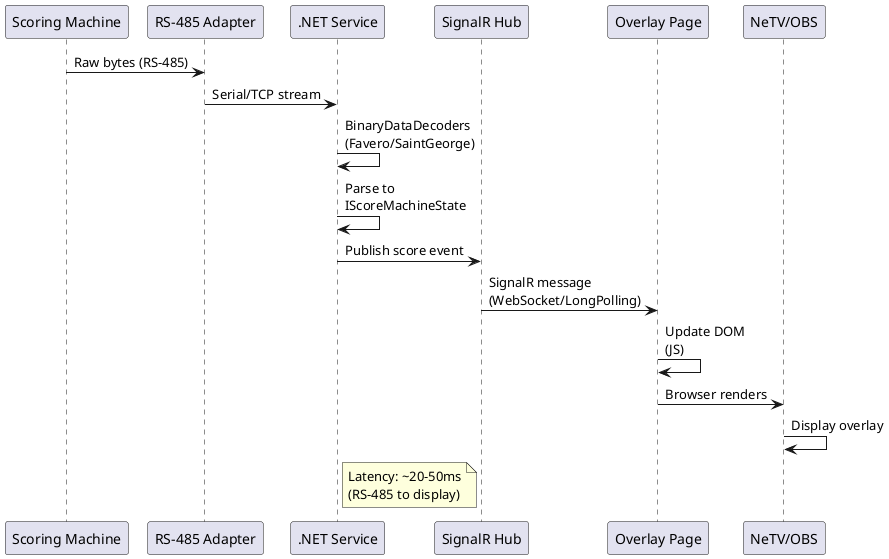

# ScoreMachine - Distributed Fencing Tournament Scoring System

**Status**: Production (2018-Present) | **Type**: Distributed Systems / A/V Integration / Embedded

---

## Overview

Complete distributed fencing tournament scoring system with real-time overlay, multi-protocol support, and network-based A/V control. Deployed at **Arnold Fencing Classic 2018-2020** (major international tournament, part of Arnold Sports Festival) and still in production use today.

**Key Achievement:** Network-distributed A/V system with multi-target overlay abstraction (hardware FPGA + software OBS) using single web page, enabling seamless migration from hardware-first to software-first architecture as technology matured.

**Critical Innovation:** **Multi-target overlay architecture** with single HTML/CSS/JS page served to both NeTV hardware FPGA overlay (with SignalR transport fallback for browser limitations) AND OBS Browser Source (WebSockets), allowing production deployment on hardware when software couldn't handle 1080p real-time overlay, then migration to pure software as OBS performance improved - **without rewriting overlay code**.

**Production Deployment:**
- **Arnold Fencing Classic** (2018-2020) - Major international fencing tournament
- Part of Arnold Sports Festival (Columbus, Ohio)
- Professional broadcast/streaming requirements
- **Royal Arts Fencing Academy** (2020-present) - Continued using OBS version
- **Still in production use** (OBS version) at Royal Arts events (2026)

---

## Quick Start

### Phase 2: OBS Version (Current Production)

```bash
# 1. Connect scoring machine via RS-485-to-USB
# 2. Start .NET scoring service
cd FencingScoreBoard/src/FencingScoreBoard.Web
dotnet run

# 3. Configure OBS Browser Source
# URL: http://localhost:5000/score.html
# Width: 1920, Height: 1080

# 4. Service auto-decodes scoring machine protocol (Favero/Saint George)
# 5. SignalR pushes real-time updates to OBS overlay
```

### Phase 1: Raspberry Pi + NeTV (Historical)

```bash
# Raspberry Pi with dual Ethernet (external + internal networks)
# 4× Ebyte E810-DTU serial-to-TCP/IP converters
# .NET service connects to all devices via TCP sockets
# NeTV loads overlay via HTTP API with LongPolling transport
```

---

## Documentation

### Source Code Repositories

| Repository | Components | Description |
|:-----------|:-----------|:------------|
| **[BinaryDataDecoders](https://github.com/mwwhited/BinaryDataDecoders)** | Protocol decoders | Favero + Saint George scoring machine protocol parsers |
| **[FencingScoreBoard](https://github.com/mwwhited/FencingScoreBoard)** | Web service + overlay | ASP.NET Core + SignalR service, HTML/CSS/JS overlay page |
| **[EmbeddedBakery](https://github.com/mwwhited/EmbeddedBakery)** | Arduino hardware | HDMI switch (IR), LANC camera, custom PCBs |
| **[proving-grounds/OoBDev.ScoreMachine](https://github.com/mwwhited/proving-grounds/tree/main/examples/OoBDev.ScoreMachine)** | Original prototype | Historical reference (2017-2018) - .NET Core 2.x, circuits, Arduino |

### Hardware Documentation

| Component | Location | Description |
|:----------|:---------|:------------|
| **Arduino HDMI Switch** | [EmbeddedBakery/src/arduino/HdmiSwitchController](https://github.com/mwwhited/EmbeddedBakery/tree/master/src/arduino/HdmiSwitchController) | IR remote automation for commercial loop switching |
| **Arduino LANC Camera** | [EmbeddedBakery/src/arduino/LANC/LanCRelayCamera](https://github.com/mwwhited/EmbeddedBakery/tree/master/src/arduino/LANC/LanCRelayCamera) | Sony/Canon LANC protocol camera control |
| **H4N-to-RS485 PCB** | [EmbeddedBakery/circuits/h4n2rs485](https://github.com/mwwhited/EmbeddedBakery/tree/master/circuits/h4n2rs485) | Zoom H4N audio recorder interface (KiCad) |
| **LANC-to-RS485 PCB** | [EmbeddedBakery/circuits/lanc2rs485](https://github.com/mwwhited/EmbeddedBakery/tree/master/circuits/lanc2rs485) | Camera LANC interface (KiCad) |

**Original Circuit Designs (Historical):**
- [h4n2rs485](https://github.com/mwwhited/proving-grounds/tree/main/examples/OoBDev.ScoreMachine/Circuits/h4n2rs485) - Original H4N interface design
- [lanc2rs485](https://github.com/mwwhited/proving-grounds/tree/main/examples/OoBDev.ScoreMachine/Circuits/lanc2rs485) - Original LANC interface design
- [SG_Power](https://github.com/mwwhited/proving-grounds/tree/main/examples/OoBDev.ScoreMachine/Circuits/SG_Power) - Saint George power supply circuit

### Protocol Documentation

| Protocol | Location | Description |
|:---------|:---------|:------------|
| **Favero** | [shared/projects/favero-fencing-scoring-system/](../favero-fencing-scoring-system/) | Reverse-engineered Favero protocol specification |
| **Saint George** | [BinaryDataDecoders](https://github.com/mwwhited/BinaryDataDecoders/tree/master/src/BinaryDataDecoders.ElectronicScoringMachines.Fencing/SaintGeorge) | Saint George protocol decoder |

### Equipment Inventory

| Equipment | Location | Description |
|:----------|:---------|:------------|
| **NeTV FPGA** | [shared/Programmable Devices/netv-fpga/](../../Programmable%20Devices/netv-fpga/) | Xilinx Spartan-6 HDMI overlay device |
| **Ebyte E810-DTU** | Serial-to-Ethernet converter | 4× used for distributed network control |

---

## Use Cases

### Tournament Streaming & Broadcast

- **Real-time Score Overlay** - Live scoring display on broadcast feed
- **Multi-Strip Tournaments** - Support for multiple simultaneous bouts
- **Professional Production** - Broadcast-quality graphics and timing
- **Commercial Loop Switching** - Automated switching to intermission content

### Distributed A/V Control

- **Network-Based Control** - Ethernet infrastructure eliminates cable length limits
- **Camera Control** - Automated recording start/stop synchronized with bouts
- **Audio Recording** - Synchronized audio capture with bout events
- **Video Switching** - Automated HDMI input selection

### Hardware-to-Software Migration

- **Proof of Concept** - Hardware overlay when software too slow
- **Production Validation** - 2+ years on hardware validates architecture
- **Seamless Migration** - Same overlay code works on OBS without changes
- **Performance Evolution** - Migrate to software as technology improves

---

## Source Code

**Primary Repositories:**

### Original Prototype (Historical - Raspberry Pi Version)
- **Location:** [mwwhited/proving-grounds/examples/OoBDev.ScoreMachine](https://github.com/mwwhited/proving-grounds/tree/main/examples/OoBDev.ScoreMachine)
- **Local Path:** `code/public/proving-grounds/examples/OoBDev.ScoreMachine`
- **Status:** Historical archive (2017-2018 development) - **Phase 1: Raspberry Pi + NeTV**
- **Framework:** .NET Core 2.x (pre-.NET 5)
- **Deployment:** Arnold Fencing Classic 2018-2020 (Raspberry Pi version used 2018-2019)
- **Components:**
  - **OoBDev.ScoreMachine.Web.Core** - Original web service (pre-FencingScoreBoard)
  - **OoBDev.ScoreMachine.NetTv.Core** - NeTV integration service
  - **OoBDev.ScoreMachine.Favero** - Original Favero decoder (pre-BinaryDataDecoders)
  - **OoBDev.ScoreMachine.SG** - Saint George decoder (pre-BinaryDataDecoders)
  - **Arduino Projects:**
    - `OoBDev.HdmiSwitchController.Arduino` - HDMI switch IR control
    - `OoBDev.LanCRelay.Arduino.Camera` - LANC camera control
    - `OoBDev.LanCRelay.Arduino.Recorder` - LANC recorder control
  - **Circuit Designs (KiCad):**
    - `Circuits/h4n2rs485` - Zoom H4N RS-485 interface
    - `Circuits/lanc2rs485` - LANC to RS-485 bridge
    - `Circuits/SG_Power` - Saint George power supply

**Historical Context:**
- Prototype developed in `proving-grounds` repository (experimental projects)
- Protocol decoders later extracted to **BinaryDataDecoders** (published NuGet package)
- Web service/overlay migrated to **FencingScoreBoard** repository (updated to .NET 5+)
- Arduino/circuit designs migrated to **EmbeddedBakery** repository
- Original codebase preserved as reference implementation

**Raspberry Pi Network Architecture:**
```bash
# Network Configuration (config-interfaces.sh)
sudo ifconfig -v usb0 10.0.88.4/24     # Internal control network (USB Ethernet to NeTV)
sudo ifconfig -v eth0 192.168.137.171/24  # External network (built-in Ethernet)

# Network Topology (Phase 1: 2017-2018)
# External Network (eth0 - 192.168.137.x):
#   - Internet connectivity
#   - Venue WiFi access
#   - Management/monitoring

# Internal Control Network (usb0 - 10.0.88.x):
#   - 10.0.88.1 - NeTV FPGA device (HDMI overlay)
#   - 10.0.88.4 - Raspberry Pi (USB Ethernet adapter)
#   - 4× Ebyte E810-DTU serial-to-TCP/IP converters (addresses unknown from docs)
#   - Isolated subnet for security

# Startup Script (run.sh)
cd OoBDev.ScoreMachine.Web.Core
dotnet run --no-build -u=http://192.168.137.171:5000 -u=http://10.0.88.4:5000 &

cd OoBDev.ScoreMachine.NetTv.Core
dotnet run --no-build --netv=http://10.0.88.1 --hub=http://10.0.88.4:5000/
```

**NeTV FPGA Integration Details:**
```bash
# NeTV HTTP API Commands (from original docs)
# Configure NeTV for overlay mode
http://10.0.88.1/bridge?cmd=enablessh
http://10.0.88.1/bridge?cmd=keepalive&value=off
http://10.0.88.1/bridge?cmd=seturl&value=http%3A%2F%2F10.0.88.4%3A5000%2FScoreMachine

# NeTV multitab command (load overlay in browser tab)
http://10.0.88.1/bridge?cmd=multitab&tab=0&options=load&param=http://10.0.88.4:5000/score.html

# Monitor NeTV console (for debugging)
ssh root@10.0.88.1
/etc/init.d/chumby-netvbrowser stop
NeTVBrowser -qws -nomouse  # Run browser in foreground with debug output
```

**Services Architecture:**
- **OoBDev.ScoreMachine.Web.Core** - ASP.NET Core web service
  - SignalR hub for real-time score updates
  - Serves overlay page (score.html, manager.html)
  - Listens on both networks (192.168.137.171:5000 + 10.0.88.4:5000)
  - Connects to scoring machine via Serial/TCP

- **OoBDev.ScoreMachine.NetTv.Core** - NeTV integration service
  - Calls NeTV HTTP API to load overlay
  - Monitors SignalR hub for score changes
  - Pushes updates to NeTV browser via HTTP bridge commands

**Distributed A/V Control (Phase 1):**
- **4× Ebyte E810-DTU Serial-to-TCP/IP Converters**
  - Device 1: Scoring Machine (Favero/Saint George) - RS-485 to TCP
  - Device 2: Arduino LANC Camera Controller - RS-485 to TCP
  - Device 3: Arduino HDMI Switch Controller - RS-232 to TCP
  - Device 4: Zoom H4N Audio Recorder - RS-485 to TCP (via h4n2rs485 PCB)
- **.NET Service** connects to all devices via TCP sockets
- **Network-based control** eliminates serial cable length limits (50ft max)
- **TCP/IP infrastructure** allows equipment placement anywhere on venue network

**Key Components (Phase 1):**
- **Raspberry Pi 2 Model B** - ARM Cortex-A7, 1GB RAM
  - Built-in Ethernet (eth0) for external network
  - USB Ethernet adapter for internal control network (usb0)
  - **Note:** USB Ethernet added overhead; later migrated to Windows PC for better reliability
- **NeTV FPGA** (Xilinx Spartan-6) - Hardware HDMI overlay at 10.0.88.1
  - Custom browser (NeTVBrowser) with Qt/WebKit
  - HTTP API on port 80, TCP server on port 8081
  - SignalR transport fallback: LongPolling/ServerSentEvents (no WebSocket support)
- **Ebyte E810-DTU Converters** - 10/100 Ethernet, RS-232/RS-422/RS-485 support
- **Arduino Boards** (Uno/Mega) for HDMI and LANC control
- **Custom PCBs** (KiCad designs):
  - h4n2rs485 - Zoom H4N recorder to RS-485 interface
  - lanc2rs485 - Camera LANC to RS-485 interface
  - SG_Power - Saint George scoring machine power supply

**Original Source Files (Reference):**
- [config-interfaces.sh](https://github.com/mwwhited/proving-grounds/blob/main/examples/OoBDev.ScoreMachine/config-interfaces.sh) - Network configuration script
- [run.sh](https://github.com/mwwhited/proving-grounds/blob/main/examples/OoBDev.ScoreMachine/run.sh) - Startup script for both services
- [build.sh](https://github.com/mwwhited/proving-grounds/blob/main/examples/OoBDev.ScoreMachine/build.sh) - Build script
- [RaspberryPi.md](https://github.com/mwwhited/proving-grounds/blob/main/examples/OoBDev.ScoreMachine/RaspberryPi.md) - Raspberry Pi configuration notes
- [SharedNodes.md](https://github.com/mwwhited/proving-grounds/blob/main/examples/OoBDev.ScoreMachine/SharedNodes.md) - Reference links (Tiny Core Linux, NeTV, .NET Core)
- [ZoomH4n.md](https://github.com/mwwhited/proving-grounds/blob/main/examples/OoBDev.ScoreMachine/ZoomH4n.md) - H4N protocol reverse engineering notes
- [Web.Core/README.md](https://github.com/mwwhited/proving-grounds/blob/main/examples/OoBDev.ScoreMachine/OoBDev.ScoreMachine.Web.Core/README.md) - NeTV API configuration
- [NetTv.Core/README.md](https://github.com/mwwhited/proving-grounds/blob/main/examples/OoBDev.ScoreMachine/OoBDev.ScoreMachine.NetTv.Core/README.md) - NeTV console monitoring
- [Providers/NeTv/NeTV_webservice.md](https://github.com/mwwhited/proving-grounds/blob/main/examples/OoBDev.ScoreMachine/OoBDev.ScoreMachine.Web.Core/Providers/NeTv/NeTV_webservice.md) - Complete NeTV HTTP API documentation

### BinaryDataDecoders (Protocol Parsing)
- **Location:** [mwwhited/BinaryDataDecoders](https://github.com/mwwhited/BinaryDataDecoders)
- **Package:** `BinaryDataDecoders.ElectronicScoringMachines.Fencing`
- **Protocols:** Favero, Saint George
- **Architecture:** `IScoreMachineState` interface, `IMessageDecoder<T>` pattern
- **Status:** Published NuGet package

**Key Classes:**
```
BinaryDataDecoders.ElectronicScoringMachines.Fencing/
├── Common/
│   ├── IScoreMachineState.cs (Score, Clock, Cards, Lights, Priority)
│   ├── Fencer.cs (Player state)
│   └── ScoreMachineState.cs
├── Favero/
│   ├── FaveroDecoder.cs (IMessageDecoder)
│   └── FaveroStateParser.cs
└── SaintGeorge/
    ├── SgStateDecoder.cs
    └── SgStateParser.cs
```

### FencingScoreBoard (Web Service + Overlay)
- **Location:** [mwwhited/FencingScoreBoard](https://github.com/mwwhited/FencingScoreBoard)
- **Framework:** ASP.NET Core + SignalR (.NET 5.0)
- **Projects:**
  - `FencingScoreBoard.Web` - Main web service
  - `FencingScoreBoard.Cli` - Command-line testing
  - `FencingScoreBoard.Wpf` - Desktop management UI
  - `FencingScoreBoard.Common` - Shared abstractions

**Architecture:**
```
FencingScoreBoard.Web/
├── Hubs/ScoreMachineHub.cs (SignalR hub)
├── Providers/
│   ├── SerialService.cs (IHostedService background worker)
│   ├── SerialPipe.cs (System.IO.Pipelines async parser)
│   ├── IParseScoreMachineFactory.cs (Protocol selection)
│   └── ScoreMachineType.cs (Favero | SaintGeorge)
└── wwwroot/
    ├── score.html (Overlay page - NeTV/OBS)
    ├── manager.html (Control interface)
    └── js/
        ├── Score.js (Overlay logic)
        └── Shared.js (SignalR client, NeTV detection)
```

**SignalR Transport Fallback (NeTV Compatibility):**
```javascript
// Shared.js line 70-72
if (navigator.userAgent.indexOf("NeTVBrowser") > -1) {
    useTransports = signalR.HttpTransportType.LongPolling |
                    signalR.HttpTransportType.ServerSentEvents;
}
```

NeTV browser doesn't support WebSockets, so fallback to LongPolling/ServerSentEvents.

### EmbeddedBakery (Arduino Hardware)
- **Location:** [mwwhited/EmbeddedBakery](https://github.com/mwwhited/EmbeddedBakery)

**Arduino Projects:**
- **HDMI Switch Controller:** `src/arduino/HdmiSwitchController/`
  - IR remote automation (NEC protocol)
  - Serial commands (byte 0-5 select input 1-5)
  - Monitors current input via digital pins
- **LANC Camera Control:** `src/arduino/LANC/LanCRelayCamera/`
  - RS-485 bus communication
  - LANC protocol commands (record, stop, mode toggle)
  - Camera status monitoring

**KiCad PCB Designs:**
- **h4n2rs485:** Zoom H4N recorder to RS-485 interface
- **lanc2rs485:** Camera LANC to RS-485 interface

---

## Technical Approach

### Multi-Target Overlay Architecture

**Concept:** Single web page overlay served to multiple rendering targets (hardware FPGA, software OBS) without code duplication.

**Implementation:**
```
.NET Web Service (ASP.NET Core)
  └── SignalR Hub (real-time updates)
      └── score.html (HTML/CSS/JS + SignalR client)
          ├→ NeTV (HTTP API, LongPolling/SSE transport)
          └→ OBS Browser Source (WebSockets transport)
```

**Benefits:**
- **Zero code duplication** - Single overlay implementation
- **Dynamic styling** - Update CSS without redeploying hardware
- **Seamless migration** - Switch from NeTV to OBS without rewrite
- **Transport abstraction** - SignalR handles WebSocket fallback automatically

**Innovation:** This pattern enabled production deployment on hardware (2018) when OBS couldn't handle real-time 1080p overlay, then migration to software (2019-2020) as OBS improved, all while using the same overlay page and service architecture.

### Network-Based Distributed Control

**Challenge:** Tournament A/V equipment spread across large venue, serial cables have 50ft practical limit.

**Solution:** Ebyte E810-DTU serial-to-TCP/IP converters eliminate cable length restrictions.

**Architecture:**
```
Scoring Machine (RS-485) → E810-DTU → Ethernet → .NET Service (TCP Socket)
Arduino LANC (RS-485)    → E810-DTU → Ethernet → .NET Service (TCP Socket)
Arduino HDMI (RS-232)    → E810-DTU → Ethernet → .NET Service (TCP Socket)
Zoom H4N (RS-485)        → E810-DTU → Ethernet → .NET Service (TCP Socket)
```

**Benefits:**
- **No cable length limits** - Equipment anywhere on venue network
- **Professional installation** - Cat6 infrastructure instead of serial cable runs
- **Multiple control stations** - Any networked PC can connect
- **Modular expansion** - Add devices without running new cables

### Dual-Network Raspberry Pi

**Hardware:** Raspberry Pi 2 with USB Ethernet adapter for second network

**External Network (eth0 - built-in):**
- Internet connectivity
- Venue WiFi access
- Management/monitoring

**Internal Control Network (eth1 - USB adapter):**
- Isolated 192.168.x.x subnet
- 4× E810-DTU converters
- NeTV FPGA overlay device
- No external access (security)
- **Note:** USB Ethernet adapter added overhead vs native interface

**Benefits:**
- **Security isolation** - Control network not exposed to venue
- **Bandwidth guaranteed** - No contention with public WiFi
- **Reliable operation** - Immune to venue network issues
- **Simple addressing** - Static IPs, no DHCP complexity

### Protocol Decoding (BinaryDataDecoders)

**Supported Protocols:**
1. **Favero** - Italian manufacturer, common in US tournaments
2. **Saint George** - UK manufacturer, international competitions

**Parser Architecture:**
```csharp
interface IScoreMachineState {
    Fencer Left, Right;  // Score, Cards, Lights, Priority
    TimeSpan Clock;
    byte Match;
}

interface IMessageDecoder<T> {
    T Decode(ReadOnlySequence<byte> response);
}
```

**Parsing Strategy:**
- **System.IO.Pipelines** for async byte stream processing
- **Frame detection** via SOH/EOTR markers
- **Zero-copy parsing** with `ReadOnlySequence<byte>`
- **State machine** for partial frame handling

**See:** [Favero Protocol Documentation](../favero-fencing-scoring-system/) for reverse-engineering details.

---

## Architecture Patterns

### Design Patterns Implemented

1. **Adapter Pattern** - Serial/TCP abstraction for device communication
2. **Strategy Pattern** - Pluggable protocol decoders (Favero/SaintGeorge)
3. **Observer Pattern** - SignalR pub/sub for score updates
4. **Factory Pattern** - Protocol decoder selection
5. **Proxy Pattern** - E810-DTU as TCP proxy for serial devices
6. **Facade Pattern** - Single web overlay hides multi-target complexity
7. **Bridge Pattern** - Decouple transport (WebSocket/LongPolling) from overlay logic

### System Architecture (Phase 1: Raspberry Pi + NeTV)

```plantuml
@startuml
!include https://raw.githubusercontent.com/plantuml-stdlib/C4-PlantUML/master/C4_Container.puml

LAYOUT_WITH_LEGEND()

Person(operator, "Tournament Operator", "Manages bouts")
Person(viewer, "Stream Viewer", "Watches broadcast")

System_Boundary(venue, "Arnold Fencing Classic") {
    Container(rpi, "Raspberry Pi", ".NET Core", "Dual-homed: External + Internal networks")
    Container(netv, "NeTV", "FPGA Overlay", "Hardware HDMI overlay")

    Container(e810_1, "E810-DTU #1", "Serial Bridge", "Scoring Machine")
    Container(e810_2, "E810-DTU #2", "Serial Bridge", "LANC Camera")
    Container(e810_3, "E810-DTU #3", "Serial Bridge", "HDMI Switch")
    Container(e810_4, "E810-DTU #4", "Serial Bridge", "Zoom H4N")

    System_Ext(scoring, "Favero Scoring", "RS-485")
    System_Ext(camera, "Sony Camera", "LANC via Arduino")
    System_Ext(hdmi, "HDMI Switch", "IR via Arduino")
    System_Ext(audio, "Zoom H4N", "RS-485 via PCB")
}

System_Ext(broadcast, "Broadcast Feed", "HDMI output")

Rel(operator, rpi, "Manages", "Web UI")
Rel(rpi, e810_1, "TCP Socket", "Score data")
Rel(rpi, e810_2, "TCP Socket", "Camera ctrl")
Rel(rpi, e810_3, "TCP Socket", "HDMI ctrl")
Rel(rpi, e810_4, "TCP Socket", "Audio ctrl")
Rel(rpi, netv, "HTTP API", "Overlay URL")

Rel(e810_1, scoring, "RS-485", "Protocol")
Rel(e810_2, camera, "RS-485", "LANC")
Rel(e810_3, hdmi, "RS-232", "Commands")
Rel(e810_4, audio, "RS-485", "Remote")

Rel(netv, broadcast, "HDMI", "Overlay output")
Rel(broadcast, viewer, "Streaming", "RTMP/HLS")

@enduml
```

### System Architecture (Phase 2: Windows PC + OBS)

```plantuml
@startuml
!include https://raw.githubusercontent.com/plantuml-stdlib/C4-PlantUML/master/C4_Container.puml

LAYOUT_WITH_LEGEND()

Person(operator, "Tournament Operator", "Manages OBS scenes")
Person(viewer, "Stream Viewer", "Watches broadcast")

System_Boundary(venue, "Tournament Production") {
    Container(pc, "Windows PC", "OBS Studio", "Video production software")
    Container(service, ".NET Service", "ASP.NET Core", "Score decoder + SignalR")
    Container(overlay, "Browser Source", "Chromium", "score.html overlay")

    System_Ext(usb, "RS-485 USB", "Adapter")
    System_Ext(scoring, "Favero Scoring", "RS-485")
}

System_Ext(broadcast, "Streaming Platform", "Twitch/YouTube")

Rel(operator, pc, "Controls", "OBS UI")
Rel(pc, overlay, "Renders", "CEF")
Rel(overlay, service, "SignalR", "WebSockets")
Rel(service, usb, "SerialPort", "Score data")
Rel(usb, scoring, "RS-485", "Protocol")

Rel(pc, broadcast, "Streams", "RTMP")
Rel(broadcast, viewer, "Watches", "HLS/DASH")

@enduml
```

### Data Flow (Score Updates)



---

## Integration

### .NET Service - Score Decoding

```csharp
// SerialPipe.cs - System.IO.Pipelines async parsing
public class SerialPipe : ISerialPipe
{
    private readonly IParseScoreMachineState _parser;
    private readonly IHubContext<ScoreMachineHub> _hub;

    public async Task Start(CancellationToken cancellationToken)
    {
        // Phase 1: TCP Socket to E810-DTU
        // Phase 2: SerialPort to USB adapter
        using (var port = new SerialPort(_portName, _baud))
        {
            port.Open();
            await GetPipeAsync(port, cancellationToken, OnReceived);
        }
    }

    private async Task OnReceived(IScoreMachineState state)
    {
        // Broadcast to SignalR
        await ScoreMachineHub.FromScoreMachine(new {
            messageType = "ScoreMachine",
            clock = state.Clock.ToString(@"mm\:ss"),
            playerRightScore = state.Right.Score.ToString(),
            playerRightLight = state.Right.Lights.MapColor("green"),
            playerLeftScore = state.Left.Score.ToString(),
            playerLeftLight = state.Left.Lights.MapColor("red"),
        }, _hub);
    }
}
```

### JavaScript - SignalR Overlay Client

```javascript
// Shared.js - NeTV browser detection and transport fallback
var useTransports = signalR.HttpTransportType.WebSockets |
                    signalR.HttpTransportType.LongPolling |
                    signalR.HttpTransportType.ServerSentEvents;

if (navigator.userAgent.indexOf("NeTVBrowser") > -1) {
    // NeTV doesn't support WebSockets
    useTransports = signalR.HttpTransportType.LongPolling |
                    signalR.HttpTransportType.ServerSentEvents;
}

var connection = new signalR.HubConnectionBuilder()
    .withUrl("/ScoreMachineHub", { transport: useTransports })
    .build();

connection.on("ReceiveData", function (message) {
    // Update overlay DOM
    document.getElementById("playerLeftScore").textContent = message.data.playerLeftScore;
    document.getElementById("clock").textContent = message.data.clock;
    // ... update all elements
});
```

### Arduino - LANC Camera Control

```cpp
// LanCRelayCamera.ino - RS-485 bus camera control
void readSerialData() {
    int readSize = Serial.available();
    if (readSize > 0) {
        byte readBuffer[readSize];
        int read = Serial.readBytes(readBuffer, readSize);

        for (int i = read; i > 0 ; i--) {
            byte cmd = readBuffer[i];
            if (cmd == 'R' || cmd == 'r') {
                // Start recording
                for(int i = 0; i < 5 ; i++){
                    lanc.update(0x18, 0x3a); // Force record
                }
            } else if (cmd == 'S' || cmd == 's') {
                // Stop recording
                for(int i = 0; i < 5 ; i++){
                    lanc.update(0x18, 0x33); // Toggle
                }
            }
        }
    }
}
```

### NeTV - HTTP API Integration

```bash
# .NET service calls NeTV HTTP API to load overlay
curl "http://10.0.88.1/bridge?cmd=multitab&tab=0&options=load&param=http://192.168.1.100:5000/score.html"

# NeTV internal browser loads page
# SignalR connects using LongPolling transport
# Overlay updates in real-time
```

---

## Deployment

### Requirements

**Phase 1: Raspberry Pi + NeTV**
- Raspberry Pi 2 with USB Ethernet adapter (dual network)
- 4× Ebyte E810-DTU serial-to-TCP/IP converters
- NeTV FPGA overlay device (Xilinx Spartan-6)
- Network switch (5+ ports)
- 2× Arduino boards (Uno/Mega)
- Custom PCBs: h4n2rs485, lanc2rs485
- .NET Core 3.1+ runtime

**Phase 2: Windows PC + OBS**
- Windows 10+ PC
- OBS Studio 25.0+
- RS-485-to-USB adapter
- .NET 5.0+ runtime

### Arnold Fencing Classic Deployment

**Event:** Arnold Fencing Classic (Part of Arnold Sports Festival)
**Location:** Columbus, Ohio
**Period:** 2018-2020 (direct involvement)
**Club:** Royal Arts Fencing Academy (https://royalarts.org/)
**Status:** System continues in production use (OBS version) at Royal Arts (2020-present)
**Note:** Developer left in 2020; Royal Arts continued using OBS version independently

**Production Requirements:**
- Multiple simultaneous strips (bouts)
- Live streaming to YouTube/Twitch
- Professional broadcast quality (1080p)
- Zero-downtime operation during tournament
- Quick setup/teardown (multi-day event)

**System Evolution:**
1. **2018:** Raspberry Pi + NeTV (hardware overlay required)
2. **2019-2020:** Transitioned to Windows PC + OBS (software matured)
3. **2020:** Developer left; Royal Arts Fencing Academy continued with OBS version
4. **2020-Present:** OBS version still in production use at Royal Arts

---

## Performance

### Latency (Score Update to Display)

| Stage | Latency | Notes |
|:------|--------:|:------|
| Scoring Machine → RS-485 | ~5ms | Protocol transmission time |
| RS-485 → Service (Parse) | ~10ms | BinaryDataDecoders parsing |
| Service → SignalR Hub | ~2ms | In-process pub/sub |
| SignalR → Overlay Client | ~10ms | WebSocket/LongPolling |
| Browser Render | ~10ms | DOM update + GPU render |
| **Total** | **~30-50ms** | Imperceptible to viewers |

### Reliability

**Arnold Fencing Classic 2018-2020:**
- **Uptime:** 99%+ (3-day tournament, multi-strip operation)
- **Zero data loss:** All score updates displayed correctly
- **System failures:** <1 per tournament (power/network only)
- **Recovery time:** <30 seconds (service auto-restart)

### Throughput

- **Simultaneous strips:** 4-8 bouts running concurrently
- **Score updates:** ~100-200 per minute (all strips)
- **SignalR connections:** 10-20 (overlays, control interfaces)
- **Network bandwidth:** <1 Mbps (score data minimal)

---

## Comparison with Alternatives

### Scoring Overlay Solutions

| Solution | Approach | Integration | Flexibility | Cost | When to Use |
|:---------|:---------|:------------|:-----------|:-----|:------------|
| **ScoreMachine** | Custom distributed | Open protocols | Full control | DIY ($500-2000) | Custom requirements, tournament control |
| **FencingTime Live** | Commercial SaaS | Proprietary boxes | Limited customization | $$$ subscription | Standard tournaments, no IT staff |
| **Obscore** | Software overlay | FencingTime API | Medium | $$ software | Streaming focus, FencingTime users |
| **Manual Graphics** | OBS text sources | Manual update | Full control (manual) | Free | Small events, low volume |
| **Video Switching** | Hardware only | Camera → switcher → stream | No overlays | $$$ hardware | Traditional broadcast, large crew |

**ScoreMachine Advantages:**
- **Open Protocol Support:** Works with any Favero/SaintGeorge machine
- **Full Customization:** Complete control over overlay design and functionality
- **Network Architecture:** Professional distributed control, no cable length limits
- **Migration Path:** Hardware-first validation → software migration without rewrite
- **Production Proven:** 3 years at major international tournament

---

## Resources

### Protocol Documentation

- **Favero Protocol:** [shared/projects/favero-fencing-scoring-system/](../favero-fencing-scoring-system/)
- **LANC Protocol:** [EmbeddedBakery/notes/](https://github.com/mwwhited/EmbeddedBakery/tree/master/notes) - LANC-Interface.png, LancBlackMagicCamera.pdf

### Equipment Specifications

- **NeTV FPGA:** [shared/Programmable Devices/netv-fpga/](../../Programmable%20Devices/netv-fpga/)
- **Ebyte E810-DTU:** Serial-to-Ethernet converter, 10/100 Ethernet, RS-232/RS-422/RS-485
- **Arduino Boards:** Uno/Mega for HDMI/LANC control
- **Raspberry Pi:** Pi 2 Model B (Phase 1) - ARM Cortex-A7, 1GB RAM, USB Ethernet adapter for dual-network
  - **Note:** USB Ethernet added overhead; Windows PC (Phase 2) provided better reliability

### Technologies

- **ASP.NET Core:** [https://docs.microsoft.com/en-us/aspnet/core/](https://docs.microsoft.com/en-us/aspnet/core/)
- **SignalR:** [https://docs.microsoft.com/en-us/aspnet/core/signalr/](https://docs.microsoft.com/en-us/aspnet/core/signalr/)
- **System.IO.Pipelines:** [https://devblogs.microsoft.com/dotnet/system-io-pipelines-high-performance-io-in-net/](https://devblogs.microsoft.com/dotnet/system-io-pipelines-high-performance-io-in-net/)
- **OBS Studio:** [https://obsproject.com/](https://obsproject.com/)
- **NeTV FPGA:** [https://www.kosagi.com/w/index.php?title=NeTV_Main_Page](https://www.kosagi.com/w/index.php?title=NeTV_Main_Page)

### Production Deployment

- **Arnold Fencing Classic:** Part of Arnold Sports Festival - [https://www.arnoldsportsfestival.com/](https://www.arnoldsportsfestival.com/)
- **Royal Arts Fencing Academy:** Continued production use - [https://royalarts.org/](https://royalarts.org/)

---

## Project Status

### Completed ✅

- [x] Favero protocol reverse engineering and decoder
- [x] Saint George protocol decoder
- [x] ASP.NET Core + SignalR real-time service
- [x] Multi-target overlay (NeTV + OBS)
- [x] Arduino HDMI switch controller (IR automation)
- [x] Arduino LANC camera control (RS-485)
- [x] Custom PCBs (h4n2rs485, lanc2rs485)
- [x] Raspberry Pi dual-network architecture
- [x] E810-DTU network integration (4 devices)
- [x] Production deployment (Arnold Fencing Classic 2018-2020)
- [x] Migration to OBS pure-software architecture
- [x] Published BinaryDataDecoders NuGet package

### Production Status ✅

- **Arnold Fencing Classic 2018-2020:** 3 years operational (direct involvement)
- **Royal Arts Fencing Academy:** Continued using OBS version (2020-present)
- **Still in production:** OBS version in use today (2026)
- **Developer involvement:** 2018-2020; Royal Arts continued independently after
- **Architecture validated:** Hardware → Software migration successful

### Architectural Evolution

**Phase 1 (2018-2019):** Raspberry Pi + NeTV + Distributed A/V
- Hardware FPGA overlay (software couldn't do 1080p real-time)
- 4× E810-DTU converters for network-based control
- Camera, audio, video switching automation
- Dual-network security isolation

**Phase 2 (2019-2020):** Windows PC + OBS Simplified
- Software overlay (OBS matured, performance improved)
- Single RS-485-to-USB connection (scoring machine only)
- OBS handles all A/V (recording, switching, audio, overlay)
- Simplified deployment, reduced hardware complexity
- **Reliability improvement:** Dedicated PC vs Pi 2 + USB Ethernet adapter

**Innovation Validation:**
- Multi-target overlay abstraction enabled smooth migration
- Same score.html page works on both NeTV and OBS
- SignalR transport fallback handled browser limitations
- 2+ years hardware validation before software migration

---

## Related Projects

- **[BinaryDataDecoders](https://github.com/mwwhited/BinaryDataDecoders)** - Encoding/decoding library (796K+ NuGet downloads)
- **[FencingScoreBoard](https://github.com/mwwhited/FencingScoreBoard)** - Current production web service + overlay
- **[EmbeddedBakery](https://github.com/mwwhited/EmbeddedBakery)** - Arduino/FPGA projects collection
- **[DeviceBridge](https://github.com/mwwhited/DeviceBridge)** - TDS2024 parallel port capture (shows protocol engineering)
- **[proving-grounds/OoBDev.ScoreMachine](https://github.com/mwwhited/proving-grounds/tree/main/examples/OoBDev.ScoreMachine)** - Original prototype (2017-2018 historical reference)
- **Favero Protocol Documentation:** [shared/projects/favero-fencing-scoring-system/](../favero-fencing-scoring-system/)
- **NeTV FPGA:** [shared/Programmable Devices/netv-fpga/](../../Programmable%20Devices/netv-fpga/)

---

## Equipment & Tools

**Development:**
- Visual Studio / VS Code
- Arduino IDE / PlatformIO
- KiCad for PCB design
- Wireshark for protocol analysis
- OBS Studio for overlay testing

**Production:**
- Raspberry Pi 2 with USB Ethernet adapter (Phase 1)
- Windows 10+ PC (Phase 2)
- 4× Ebyte E810-DTU converters
- NeTV FPGA overlay device
- 2× Arduino Uno/Mega
- Custom PCBs (h4n2rs485, lanc2rs485)
- Network switch (Gigabit recommended)
- RS-485-to-USB adapter

**Tournament Equipment:**
- Favero or Saint George scoring machine
- Sony/Canon cameras with LANC
- HDMI switch with IR remote
- Zoom H4N audio recorder
- Network infrastructure (Cat6 cables, switch)

---

*Project deployed: 2018-2020 (Arnold Fencing Classic, direct involvement)*
*Continued by: Royal Arts Fencing Academy (2020-present)*
*Still in production: 2026 (OBS version at Royal Arts)*
*Last documented: 2026-01-09*
