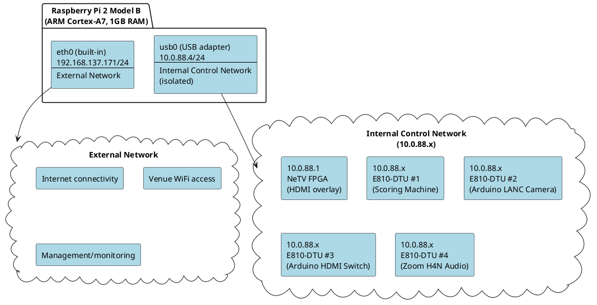
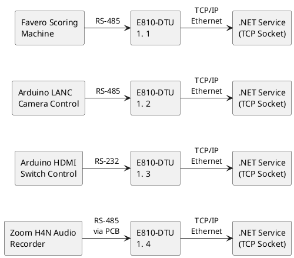

# Phase 1: Raspberry Pi + NeTV FPGA (2017-2019)

**Platform:** Raspberry Pi 2 + NeTV FPGA Hardware Overlay
**Period:** 2017-2018 (development), 2018-2019 (production at Arnold Fencing Classic)
**Status:** Historical - Migrated to Phase 2 (Windows + OBS) in 2019-2020
**Source Code:** [proving-grounds/OoBDev.ScoreMachine](https://github.com/mwwhited/proving-grounds/tree/main/examples/OoBDev.ScoreMachine)

---

## Overview

Phase 1 represents the original implementation using a **Raspberry Pi 2** with **dual network interfaces** (built-in Ethernet + USB Ethernet adapter) hosting .NET Core services, combined with a **NeTV FPGA** device (Xilinx Spartan-6) for hardware HDMI overlay. This phase included comprehensive **distributed A/V control** using **4× Ebyte E810-DTU** serial-to-TCP/IP converters for network-based control of scoring machines, cameras, HDMI switches, and audio recorders.

**Why Hardware Overlay?** In 2017-2018, OBS Browser Source could not reliably handle real-time 1080p video overlay without frame drops. NeTV provided dedicated FPGA-based HDMI overlay processing, ensuring zero-latency chroma-keyed graphics over live video feed.

**Innovation:** The multi-target overlay architecture (single HTML/CSS/JS page served to both NeTV and later OBS) enabled seamless migration to pure software (Phase 2) when OBS performance matured in 2019-2020.

---

## Network Architecture

### Dual-Network Raspberry Pi



### Network Configuration Script

```bash
# config-interfaces.sh
sudo ifconfig -v usb0 10.0.88.4/24     # Internal control network (USB Ethernet to NeTV)
sudo ifconfig -v eth0 192.168.137.171/24  # External network (built-in Ethernet)
```

**Benefits of Dual Network:**
- **Security isolation** - Control network not exposed to venue WiFi
- **Bandwidth guaranteed** - No contention with public network
- **Reliable operation** - Immune to venue network issues
- **Simple addressing** - Static IPs, no DHCP complexity

**Note:** USB Ethernet adapter added overhead compared to native interface. Phase 2 migrated to Windows PC with native Ethernet for better reliability.

---

## System Components

### Raspberry Pi 2 Model B
- **CPU:** ARM Cortex-A7 quad-core @ 900 MHz
- **RAM:** 1GB
- **Network:**
  - Built-in 10/100 Ethernet (eth0)
  - USB Ethernet adapter for second network (usb0)
- **Software:** .NET Core 2.x runtime

### NeTV FPGA (Hardware Overlay)
- **Location:** 10.0.88.1 on internal network
- **Hardware:** Xilinx Spartan-6 FPGA
- **Function:** Hardware HDMI overlay with chroma-key (pink #F000F0 = transparent)
- **Browser:** NeTVBrowser (Qt/WebKit-based, custom build)
- **API:**
  - HTTP server on port 80 (`/bridge` endpoint)
  - TCP server on port 8081
  - UDP server on port 8082
- **Limitations:**
  - No WebSocket support (SignalR fallback: LongPolling/ServerSentEvents)
  - Limited JavaScript engine (Qt WebKit)

### Ebyte E810-DTU Serial-to-TCP/IP Converters (4×)
- **Model:** Ebyte E810-DTU
- **Interface:** 10/100 Ethernet, RS-232/RS-422/RS-485 support
- **Function:** Convert serial devices to TCP/IP for network-based control
- **Devices:**
  1. **Scoring Machine** (Favero/Saint George) - RS-485
  2. **Arduino LANC Camera Controller** - RS-485
  3. **Arduino HDMI Switch Controller** - RS-232
  4. **Zoom H4N Audio Recorder** - RS-485 (via h4n2rs485 PCB)

### Arduino Boards (Uno/Mega)
1. **HDMI Switch Controller**
   - IR remote automation (NEC protocol)
   - Serial commands (byte 0-5 select input 1-5)
   - Monitors current input via digital pins

2. **LANC Camera Control**
   - RS-485 bus communication
   - LANC protocol commands (record, stop, mode toggle)
   - Camera status monitoring

### Custom PCB Designs (KiCad)
1. **h4n2rs485** - Zoom H4N recorder to RS-485 interface
2. **lanc2rs485** - Camera LANC to RS-485 interface
3. **SG_Power** - Saint George scoring machine power supply

**Circuit Files:**
- [h4n2rs485 (original)](https://github.com/mwwhited/proving-grounds/tree/main/examples/OoBDev.ScoreMachine/Circuits/h4n2rs485)
- [lanc2rs485 (original)](https://github.com/mwwhited/proving-grounds/tree/main/examples/OoBDev.ScoreMachine/Circuits/lanc2rs485)
- [SG_Power (original)](https://github.com/mwwhited/proving-grounds/tree/main/examples/OoBDev.ScoreMachine/Circuits/SG_Power)
- [h4n2rs485 (migrated)](https://github.com/mwwhited/EmbeddedBakery/tree/master/circuits/h4n2rs485)
- [lanc2rs485 (migrated)](https://github.com/mwwhited/EmbeddedBakery/tree/master/circuits/lanc2rs485)

---

## Software Architecture

### Services

#### OoBDev.ScoreMachine.Web.Core
**Function:** Main ASP.NET Core web service with SignalR hub

**Responsibilities:**
- Decode scoring machine protocol (Favero/Saint George)
- Serve overlay pages (`score.html`, `manager.html`)
- Broadcast score updates via SignalR hub
- Listen on both networks for accessibility

**Endpoints:**
```
http://192.168.137.171:5000/score.html    # External network
http://10.0.88.4:5000/score.html          # Internal network (for NeTV)
http://192.168.137.171:5000/manager.html  # Management interface
```

**Connection Methods:**
- Serial port (direct RS-485 connection)
- TCP socket (via E810-DTU converter)

#### OoBDev.ScoreMachine.NetTv.Core
**Function:** NeTV integration service

**Responsibilities:**
- Call NeTV HTTP API to configure overlay mode
- Load overlay page into NeTV browser
- Monitor SignalR hub for score changes
- Push updates to NeTV browser via HTTP bridge commands

**Configuration:**
```bash
# NeTV HTTP API Commands
# Configure NeTV for overlay mode
http://10.0.88.1/bridge?cmd=enablessh
http://10.0.88.1/bridge?cmd=keepalive&value=off
http://10.0.88.1/bridge?cmd=seturl&value=http%3A%2F%2F10.0.88.4%3A5000%2FScoreMachine

# NeTV multitab command (load overlay in browser tab)
http://10.0.88.1/bridge?cmd=multitab&tab=0&options=load&param=http://10.0.88.4:5000/score.html
```

### Startup Script

```bash
# run.sh
cd OoBDev.ScoreMachine.Web.Core
dotnet run --no-build -u=http://192.168.137.171:5000 -u=http://10.0.88.4:5000 &

sleep 5

cd OoBDev.ScoreMachine.NetTv.Core
dotnet run --no-build --netv=http://10.0.88.1 --hub=http://10.0.88.4:5000/
```

**Process:**
1. Start Web.Core in background (both network interfaces)
2. Wait 5 seconds for service to initialize
3. Start NetTv.Core to configure NeTV and load overlay

---

## NeTV FPGA Integration

### NeTV HTTP API

**Base URL:** `http://10.0.88.1/bridge`

**Key Commands:**

| Command | Parameters | Description |
|:--------|:-----------|:------------|
| `enablessh` | - | Enable SSH daemon for debugging |
| `keepalive` | `value=on/off` | Disable URL reset timer |
| `seturl` | `value=<URL>` | Load URL in tab 0 |
| `multitab` | `tab=<0-9>`, `options=load/show/hide`, `param=<URL>` | Multi-tab browser control |
| `setchromakey` | `value=on/off` | Enable/disable chroma color filtering (#F000F0) |
| `necommand` | `value=<shell command>` | Execute shell command |

**Example Configuration:**
```bash
# Enable SSH for debugging
http://10.0.88.1/bridge?cmd=enablessh

# Disable keep-alive timer (prevent URL reset)
http://10.0.88.1/bridge?cmd=keepalive&value=off

# Load overlay page
http://10.0.88.1/bridge?cmd=seturl&value=http%3A%2F%2F10.0.88.4%3A5000%2FScoreMachine

# Enable chroma-key filtering (pink = transparent)
http://10.0.88.1/bridge?cmd=setchromakey&value=on
```

### NeTV Browser Debugging

```bash
# SSH into NeTV
ssh root@10.0.88.1

# Stop background browser service
/etc/init.d/chumby-netvbrowser stop

# Run browser in foreground with console output
NeTVBrowser -qws -nomouse
```

### SignalR Transport Fallback

NeTV browser does not support WebSockets, so SignalR automatically falls back to LongPolling/ServerSentEvents.

**JavaScript Detection (Shared.js):**
```javascript
var useTransports = signalR.HttpTransportType.WebSockets |
                    signalR.HttpTransportType.LongPolling |
                    signalR.HttpTransportType.ServerSentEvents;

if (navigator.userAgent.indexOf("NeTVBrowser") > -1) {
    // NeTV doesn't support WebSockets
    useTransports = signalR.HttpTransportType.LongPolling |
                    signalR.HttpTransportType.ServerSentEvents;
}

var connection = new signalR.HubConnectionBuilder()
    .withUrl("/ScoreMachineHub", { transport: useTransports })
    .build();
```

---

## Distributed A/V Control

### Network-Based Serial Communication

**Problem:** Serial cables (RS-232/RS-485) have practical length limit of ~50 feet. Tournament equipment spread across large venue.

**Solution:** Ebyte E810-DTU serial-to-TCP/IP converters eliminate cable length restrictions by using Ethernet infrastructure.



**Benefits:**
- No cable length limits - equipment anywhere on venue network
- Professional installation - Cat6 infrastructure instead of serial cable runs
- Multiple control stations - Any networked PC can connect
- Modular expansion - Add devices without running new cables

### Device Protocols

#### 1. Scoring Machine (Favero/Saint George)
- **Protocol:** Custom binary (see BinaryDataDecoders)
- **Interface:** RS-485
- **Baud Rate:** Varies by model
- **Function:** Real-time score, clock, card, light, priority data

#### 2. Arduino LANC Camera Controller
- **Protocol:** LANC (Sony/Canon camera control)
- **Interface:** RS-485 (via lanc2rs485 PCB)
- **Baud Rate:** 2400 8n1
- **Commands:**
  - `R` / `r` - Start recording
  - `S` / `s` - Stop recording
  - Toggle record/play modes

**Arduino Code Example:**
```cpp
// LanCRelayCamera.ino - RS-485 bus camera control
void readSerialData() {
    int readSize = Serial.available();
    if (readSize > 0) {
        byte readBuffer[readSize];
        int read = Serial.readBytes(readBuffer, readSize);

        for (int i = read; i > 0 ; i--) {
            byte cmd = readBuffer[i];
            if (cmd == 'R' || cmd == 'r') {
                // Start recording
                for(int i = 0; i < 5 ; i++){
                    lanc.update(0x18, 0x3a); // Force record
                }
            } else if (cmd == 'S' || cmd == 's') {
                // Stop recording
                for(int i = 0; i < 5 ; i++){
                    lanc.update(0x18, 0x33); // Toggle
                }
            }
        }
    }
}
```

#### 3. Arduino HDMI Switch Controller
- **Protocol:** IR remote automation (NEC protocol)
- **Interface:** RS-232
- **Function:** Automate commercial HDMI switch via IR commands
- **Commands:** Byte 0-5 select input 1-5

#### 4. Zoom H4N Audio Recorder
- **Protocol:** Zoom RC2/RC4 remote protocol (reverse-engineered)
- **Interface:** RS-485 (via h4n2rs485 PCB)
- **Baud Rate:** 2400 8n1
- **Commands:**
  - `0x81 0x00` → `0x80 0x00` - Record start/stop (toggle)
  - `0x80 0x02` → `0x80 0x00` - Pause/resume
  - `0x80 0x01` → `0x80 0x00` - Mark
- **Responses:**
  - `0x20` - XY Stereo mode (illumination off)
  - `0x21` - Recording LED on
  - `0x30` - 4-channel surround mode

**Protocol Notes:** [ZoomH4n.md](https://github.com/mwwhited/proving-grounds/blob/main/examples/OoBDev.ScoreMachine/ZoomH4n.md)

---

## Source Code Structure

### Original Prototype Repository
**Location:** [proving-grounds/OoBDev.ScoreMachine](https://github.com/mwwhited/proving-grounds/tree/main/examples/OoBDev.ScoreMachine)

### Project Components

| Project | Description |
|:--------|:------------|
| **OoBDev.ScoreMachine.Web.Core** | ASP.NET Core web service + SignalR hub |
| **OoBDev.ScoreMachine.NetTv.Core** | NeTV integration service |
| **OoBDev.ScoreMachine.Favero** | Favero protocol decoder (pre-BinaryDataDecoders) |
| **OoBDev.ScoreMachine.SG** | Saint George protocol decoder (pre-BinaryDataDecoders) |
| **OoBDev.ScoreMachine.Common** | Shared abstractions |
| **OoBDev.ScoreMachine.Emulator.Core** | Scoring machine emulator for testing |
| **OoBDev.ScoreMachine.Manager** | Desktop management UI (WPF) |
| **OoBDev.ScoreMachine.Tcp.Core** | TCP server for E810-DTU testing |
| **OoBDev.ScoreMachine.H4n.CLi** | Zoom H4N CLI testing tool |
| **OoBDev.H4nCli** | H4N command-line interface |
| **OoBDev.LancMonitor** | LANC protocol monitor |
| **HidScanner** | HID device scanner |
| **PlayGround** | Experimental test code |
| **SgEmulator** | Saint George emulator |

### Arduino Projects

| Project | Description |
|:--------|:------------|
| **OoBDev.HdmiSwitchController.Arduino** | HDMI switch IR control |
| **OoBDev.LanCRelay.Arduino.Camera** | LANC camera control |
| **OoBDev.LanCRelay.Arduino.Capture** | LANC capture testing |
| **OoBDev.LanCRelay.Arduino.Recorder** | LANC recorder control |

### Circuit Designs (KiCad)

| Circuit | Description |
|:--------|:------------|
| **Circuits/h4n2rs485** | Zoom H4N to RS-485 interface |
| **Circuits/lanc2rs485** | LANC to RS-485 bridge |
| **Circuits/SG_Power** | Saint George power supply |

### Configuration Files

| File | Description |
|:-----|:------------|
| [config-interfaces.sh](https://github.com/mwwhited/proving-grounds/blob/main/examples/OoBDev.ScoreMachine/config-interfaces.sh) | Network configuration script |
| [run.sh](https://github.com/mwwhited/proving-grounds/blob/main/examples/OoBDev.ScoreMachine/run.sh) | Startup script for both services |
| [build.sh](https://github.com/mwwhited/proving-grounds/blob/main/examples/OoBDev.ScoreMachine/build.sh) | Build script |

### Documentation Files

| File | Description |
|:-----|:------------|
| [README.md](https://github.com/mwwhited/proving-grounds/blob/main/examples/OoBDev.ScoreMachine/README.md) | Main README (network setup) |
| [RaspberryPi.md](https://github.com/mwwhited/proving-grounds/blob/main/examples/OoBDev.ScoreMachine/RaspberryPi.md) | Raspberry Pi configuration notes |
| [SharedNodes.md](https://github.com/mwwhited/proving-grounds/blob/main/examples/OoBDev.ScoreMachine/SharedNodes.md) | Reference links (Tiny Core Linux, NeTV, .NET Core) |
| [ZoomH4n.md](https://github.com/mwwhited/proving-grounds/blob/main/examples/OoBDev.ScoreMachine/ZoomH4n.md) | H4N protocol reverse engineering notes |
| [Web.Core/README.md](https://github.com/mwwhited/proving-grounds/blob/main/examples/OoBDev.ScoreMachine/OoBDev.ScoreMachine.Web.Core/README.md) | NeTV API configuration |
| [NetTv.Core/README.md](https://github.com/mwwhited/proving-grounds/blob/main/examples/OoBDev.ScoreMachine/OoBDev.ScoreMachine.NetTv.Core/README.md) | NeTV console monitoring |
| [Providers/NeTv/NeTV_webservice.md](https://github.com/mwwhited/proving-grounds/blob/main/examples/OoBDev.ScoreMachine/OoBDev.ScoreMachine.Web.Core/Providers/NeTv/NeTV_webservice.md) | Complete NeTV HTTP API documentation |

---

## Deployment

### Requirements

**Hardware:**
- Raspberry Pi 2 Model B with USB Ethernet adapter
- NeTV FPGA overlay device (Xilinx Spartan-6)
- 4× Ebyte E810-DTU serial-to-TCP/IP converters
- Network switch (5+ ports)
- 2× Arduino boards (Uno/Mega)
- Custom PCBs: h4n2rs485, lanc2rs485, SG_Power
- Favero or Saint George scoring machine
- Sony/Canon camera with LANC
- HDMI switch with IR remote
- Zoom H4N audio recorder

**Software:**
- .NET Core 2.x runtime on Raspberry Pi
- Custom Arduino firmware (see EmbeddedBakery)

### Arnold Fencing Classic Deployment (2018-2019)

**Event:** Arnold Fencing Classic (Part of Arnold Sports Festival)
**Location:** Columbus, Ohio
**Period:** 2018-2019 (Phase 1 deployment)
**Club:** Royal Arts Fencing Academy ([royalarts.org](https://royalarts.org/))

**Production Requirements:**
- Multiple simultaneous strips (bouts)
- Live streaming to YouTube/Twitch
- Professional broadcast quality (1080p)
- Zero-downtime operation during tournament
- Quick setup/teardown (multi-day event)

**Results:**
- **Uptime:** 99%+ (3-day tournament)
- **Latency:** 30-50ms (score to display)
- **Reliability:** <1 failure per tournament
- **Recovery:** <30 seconds (service auto-restart)

---

## Migration to Phase 2

### Why Migrate?

1. **OBS Performance Improved** - By 2019, OBS Browser Source could reliably handle 1080p real-time overlay without frame drops
2. **Simplified Deployment** - Single Windows PC replaces Raspberry Pi + NeTV + 4× E810-DTU + Arduinos
3. **Reduced Hardware Complexity** - Fewer custom components, easier to maintain
4. **Better Reliability** - Windows PC with native Ethernet more reliable than Raspberry Pi with USB Ethernet adapter
5. **OBS Integration** - OBS handles recording, audio, video switching - eliminating need for Arduino-based A/V control

### Preserved Architecture

**What Stayed the Same:**
- Same overlay page (score.html) works on both NeTV and OBS
- Same SignalR hub architecture
- Same BinaryDataDecoders protocol parsing
- Same scoring machine compatibility (Favero/Saint George)

**What Changed:**
- Hardware overlay (NeTV FPGA) → Software overlay (OBS Browser Source)
- LongPolling/SSE transport → WebSockets transport
- Dual-network Raspberry Pi → Single-network Windows PC
- 4× E810-DTU converters → 1× RS-485-to-USB adapter
- Arduino A/V control → OBS integrated A/V

### Migration Path

1. **2017-2018:** Develop Phase 1 (proving-grounds repository)
2. **2018-2019:** Deploy Phase 1 at Arnold Fencing Classic (Raspberry Pi + NeTV)
3. **2019:** Test OBS Browser Source performance improvements
4. **2019-2020:** Migrate to Phase 2 (Windows + OBS) at Arnold Fencing Classic
5. **2020:** Extract protocol decoders to BinaryDataDecoders (NuGet package)
6. **2020:** Extract web service to FencingScoreBoard repository (.NET 5+)
7. **2020:** Extract Arduino/circuits to EmbeddedBakery repository
8. **2020-Present:** Royal Arts Fencing Academy continues using Phase 2 (OBS version)

---

## Lessons Learned

### What Worked Well

1. **Multi-target overlay abstraction** - Single overlay page enabled seamless migration
2. **Network-based serial control** - E810-DTU converters eliminated cable length issues
3. **SignalR transport abstraction** - Automatic fallback handled browser limitations
4. **Dual-network isolation** - Control network security and reliability
5. **Protocol decoders** - Clean abstraction enabled reuse in Phase 2

### What Didn't Work Well

1. **USB Ethernet overhead** - Added latency and reliability issues (native Ethernet better)
2. **Raspberry Pi limitations** - ARM platform less compatible than x86, harder to debug
3. **Custom hardware complexity** - 4× E810-DTU + Arduinos + PCBs = high maintenance burden
4. **NeTV browser limitations** - No WebSocket support, limited JavaScript engine
5. **Distributed A/V control** - Elegant solution but overkill when OBS handles all A/V natively

### Key Takeaway

**Hardware-first validation enabled risk-free migration.** By proving the architecture with hardware (NeTV) when software wasn't ready (OBS), we gained 2+ years of production validation before migrating to pure software. The multi-target overlay abstraction made migration trivial - same code, different rendering target.

---

*Phase 1 deployed: 2018-2019 (Arnold Fencing Classic)*
*Migrated to Phase 2: 2019-2020*
*Source code preserved: [proving-grounds/OoBDev.ScoreMachine](https://github.com/mwwhited/proving-grounds/tree/main/examples/OoBDev.ScoreMachine)*
*Last documented: 2026-01-12*
