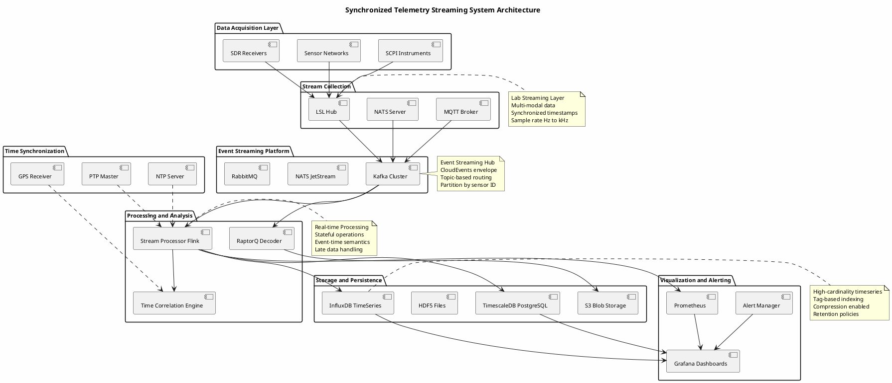
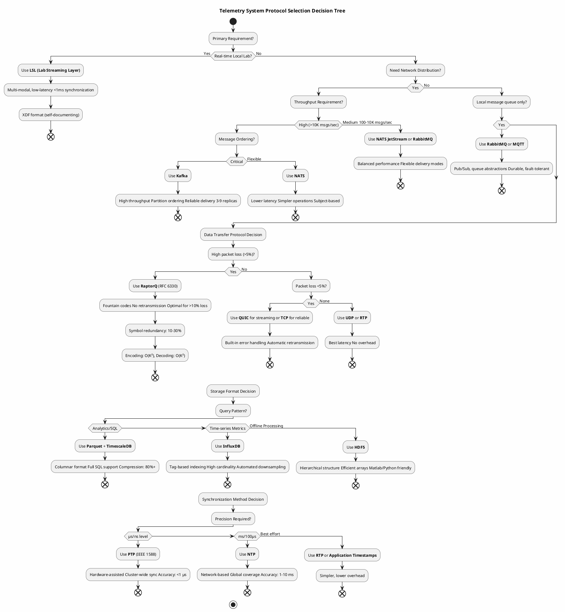

# Synchronized Telemetry Streaming Research

Research project exploring real-time, synchronized streaming of telemetry data across multiple sources with focus on protocol design, stream synchronization, and distributed architecture patterns.

## Table of Contents

- [Project Overview](#project-overview)
- [Directory Structure](#directory-structure)
- [Key Research Documents](#key-research-documents)
- [Research Focus Areas](#research-focus-areas)
- [Current Status](#current-status)
- [Related Work](#related-work)
- [Notes for Contributors](#notes-for-contributors)
- [Links](#links)
- [Project Organization](#project-organization)

## Project Overview

This research investigates modern protocols and patterns for streaming synchronized telemetry data from multiple sources simultaneously. Key focus areas include:

- **Real-Time Streaming Protocols** (RTSP 2.0, RTP, RTCP)
- **Multi-Stream Synchronization** (RTP sync, rapid synchronization techniques)
- **Stream Multiplexing** (grouping semantics, payload formats)
- **Cloud-Native Event Formats** (CloudEvents specification)
- **Distributed Architecture Patterns** (P2P design from BitTorrent v2)
- **Telemetry Collection Standards** (ALTO protocol, network telemetry)

## System Architecture

Top-level view of how data acquisition, event streaming, time sync, storage, and visualization
layers fit together:



### Protocol Selection Decision Tree

Which protocol/format to use at each layer (streaming transport, data-loss handling, storage
format, time sync precision):



## Directory Structure

```
synchronized-telemetry-streaming-research/
├── README.md                          # This file
│
├── documents/                         # RFC and specification documents (40+)
│   ├── RFC7826_RTSP2.0.txt
│   ├── RFC8108_MultipleRTPStreams.txt
│   ├── RFC6330_RaptorQ.pdf
│   ├── CloudEvents_Spec.md
│   ├── BitTorrentV2_BEP52.md
│   └── (27 more standards documents)
│
├── examples/                          # Working code examples (15 files)
│   ├── python/
│   │   ├── lsl-scpi-bridge/         # SCPI instrument + LSL streaming
│   │   │   ├── README.md
│   │   │   ├── lsl_scpi_producer.py
│   │   │   ├── scpi_instrument.py
│   │   │   ├── lsl_outlet.py
│   │   │   ├── config.yaml
│   │   │   └── requirements.txt
│   │   └── kafka-telemetry/         # Kafka + CloudEvents producer
│   │       ├── README.md
│   │       ├── kafka_producer.py
│   │       ├── cloudevents_wrapper.py
│   │       ├── telemetry_generator.py
│   │       ├── config.yaml
│   │       └── requirements.txt
│   ├── dotnet/
│   │   └── raptorq-transfer/        # RaptorQ erasure coding example
│   │       ├── README.md
│   │       ├── Program.cs
│   │       ├── RaptorQEncoder.cs
│   │       ├── RaptorQDecoder.cs
│   │       ├── PacketSimulator.cs
│   │       └── RaptorQExample.csproj
│   └── configs/
│       └── grafana/                  # Grafana dashboard configs (future)
│
├── guides/                            # Integration and deployment guides
│   ├── integration/                   # How-to guides for real-world scenarios
│   │   ├── scpi-lsl-integration.md          # Lab instrument streaming
│   │   ├── kafka-cloudevents-event-streaming.md
│   │   ├── raptorq-reliable-transfer.md
│   │   └── passive-radar-multi-receiver.md
│   └── deployment/                   # Production deployment guides
│       ├── hardware-requirements.md         # Sizing for light/medium/heavy
│       ├── configuration-templates.md      # Kafka, InfluxDB, Prometheus configs
│       └── troubleshooting.md             # Common issues and solutions
│
├── benchmarks/                        # Performance benchmarks
│   ├── raptorq-overhead/             # Erasure coding comparison
│   │   ├── README.md
│   │   ├── benchmark-results.md
│   │   └── test-script.py
│   ├── message-broker-latency/       # Kafka vs NATS vs Pulsar
│   │   ├── README.md
│   │   ├── benchmark-results.md
│   │   ├── benchmark.py
│   │   └── docker-compose.yaml
│   ├── storage-compression/          # HDF5 vs Parquet vs XDF
│   │   ├── README.md
│   │   ├── benchmark-results.md
│   │   └── test-data-generator.py
│   └── timeseries-cardinality/       # InfluxDB vs TimescaleDB vs QuestDB
│       ├── README.md
│       ├── benchmark-results.md
│       ├── load-generator.py
│       └── docker-compose.yaml
│
├── streaming/                         # Event streaming systems research
│   ├── kafka-alternatives-patterns.md
│   └── event-streaming-and-blob-transfer.md
│
├── storage/                           # Storage and persistence research
│   └── blob-stream-storage-standards.md
│
├── transfer/                          # Reliable transfer protocols
│   └── out-of-order-blob-transfer.md
│
├── reference/                         # Navigation and reference
│   ├── INDEX.md                       # Quick-start navigation
│   ├── GLOSSARY.md                    # Terminology reference
│   ├── RESEARCH_BIBLIOGRAPHY.md       # 100+ standards and papers
│   ├── FOSS-STANDARDS-FOCUS.md
│   ├── PROJECT_COMPLETION_SUMMARY.md
│   └── PROJECT_SETUP_SUMMARY.md
│
└── references/                        # Download registry
    └── downloaded-sources.md         # Sources for all documents
```

## Key Research Documents

### Core Protocol Standards

| Document | Purpose | Key Concepts |
|----------|---------|--------------|
| **RFC 7826** | RTSP 2.0 Protocol | Real-time streaming, session management, media delivery |
| **RFC 8108** | Multi-Stream RTP | Stream grouping, multiplexing semantics, payload coordination |
| **RFC 8861** | RTCP Multi-Stream | Synchronized feedback, statistics aggregation, stream correlation |
| **RFC 6051** | Rapid RTP Sync | Fast synchronization techniques, clock recovery, sync point negotiation |

### Supporting Standards

| Document | Purpose | Relevance |
|----------|---------|-----------|
| **RFC 7233** | HTTP Range Requests | Partial data retrieval, resumable streaming |
| **RFC 9232** | Network Telemetry | Telemetry collection, distribution, analytics |
| **CloudEvents** | Event Format | Standardized event representation, cloud-native compatibility |
| **BEP 52** | BitTorrent v2 | Distributed architecture patterns, P2P design |

## Research Focus Areas

### 1. Synchronization Mechanisms
- Multi-stream clock synchronization (NTP, RTP timestamps)
- Rapid sync techniques from RFC 6051
- Latency compensation and jitter handling
- Cross-stream timing correlation

### 2. Protocol Architecture
- RTSP 2.0 as session control layer
- RTP for media transport with extended profiles
- RTCP for feedback and synchronization
- HTTP range requests for resilience

### 3. Event Standardization
- CloudEvents as universal telemetry event format
- Payload schema design for multi-source telemetry
- Metadata standards for stream correlation
- Versioning and compatibility considerations

### 4. Distributed Streaming
- Lessons from BitTorrent v2 architecture
- P2P telemetry distribution patterns
- Decentralized collection and aggregation
- Resilience and fault tolerance

### 5. Network Telemetry
- ALTO protocol for network-aware streaming
- QoS-aware stream selection and adaptation
- Per-stream performance metrics
- End-to-end latency optimization

## Phase 1: Research & Documentation (Complete)

- [x] Created project directory structure
- [x] Downloaded RFC and standards documents (40+ standards)
- [x] Created downloaded-sources registry
- [x] Comprehensive research bibliography (100+ resources)
- [x] FOSS recommendations and glossary
- [x] Protocol comparison matrices

## Phase 2: Implementation & Deployment (Complete)

**Diagrams** (11 PlantUML diagrams, embedded inline in their host docs — see below, not standalone `.puml` files)
- [x] System architecture overview — `README.md` (this file)
- [x] Protocol selection decision tree — `README.md` (this file)
- [x] SCPI-LSL integration + LSL stream synchronization — `guides/integration/scpi-lsl-integration.md`
- [x] LSL multi-modal recording — `examples/python/lsl-scpi-bridge/README.md`
- [x] Kafka event architecture + CloudEvents message flow — `guides/integration/kafka-cloudevents-event-streaming.md`
- [x] RaptorQ transfer architecture + encoding/decoding flow — `guides/integration/raptorq-reliable-transfer.md`
- [x] Multi-stream time synchronization — `guides/integration/passive-radar-multi-receiver.md`
- [x] Timeseries storage pipeline — `storage/blob-stream-storage-standards.md`

**Code Examples** (15 files)
- [x] Python: LSL-SCPI Bridge (6 files: producer, SCPI client, LSL outlet factory, config)
- [x] Python: Kafka Telemetry (6 files: producer, CloudEvents wrapper, data generator, config)
- [x] .NET: RaptorQ Transfer (4 files: encoder, decoder, packet simulator, main)

**Integration Guides** (4 files)
- [x] SCPI Instrument Control + LSL Integration
- [x] Kafka Event Streaming with CloudEvents
- [x] RaptorQ Reliable Transfer
- [x] Passive Radar Multi-Receiver Synchronization

**Deployment Guides** (3 files)
- [x] Hardware Requirements for Deployments
- [x] Configuration Templates (Kafka, InfluxDB, Prometheus, Grafana)
- [x] Troubleshooting Guide

**Benchmarks** (4 suites)
- [x] RaptorQ Overhead vs Alternatives
- [x] Message Broker Latency (Kafka vs NATS vs Pulsar)
- [x] Storage Format Compression Ratios
- [x] Time-Series DB Cardinality Performance

## Related Work

This research builds on:
- Real-time media streaming (RTSP, RTP/RTCP standards)
- Distributed systems patterns
- Network telemetry collection
- Cloud-native event-driven architectures

## Notes for Contributors

When adding to this research:
1. Place downloaded standards in `/documents/` with descriptive filenames
2. Update `references/downloaded-sources.md` with source URLs and purposes
3. Add architecture diagrams to `/diagrams/` (use PlantUML or Mermaid)
4. Document research findings and design decisions
5. Cross-reference related FPGA/embedded projects in the main notebook

## Links

- **IETF:** https://datatracker.ietf.org/
- **RFC Editor:** https://www.rfc-editor.org/
- **CloudEvents:** https://github.com/cloudevents/spec
- **BitTorrent Enhancement Proposals:** https://www.bittorrent.org/beps/

## Project Organization

The research is organized into topic-based subdirectories for clarity:

```
synchronized-telemetry-streaming-research/
├── README.md                   # This file - project overview
├── documents/                  # Downloaded RFC and standard documents
│
├── streaming/                  # Event streaming systems
│   ├── kafka-alternatives-patterns.md         # Event streaming technologies comparison
│   └── event-streaming-and-blob-transfer.md   # Event formats, architectures, integration
│
├── storage/                    # Persistent storage systems
│   └── blob-stream-storage-standards.md       # Storage formats, databases, lifecycle
│
├── transfer/                   # Reliable blob transfer protocols
│   └── out-of-order-blob-transfer.md          # RaptorQ, FEC, resilience patterns
│
├── protocols/                  # Real-time streaming protocols (future)
│   └── (RTSP, RTP, RTCP documentation)
│
├── reference/                  # Navigation, reference, and meta documents
│   ├── INDEX.md                # Quick-start guide and navigation
│   ├── GLOSSARY.md             # Comprehensive terminology reference
│   ├── RESEARCH_BIBLIOGRAPHY.md # Standards, papers, implementations catalog
│   ├── FOSS-STANDARDS-FOCUS.md  # Open-source and open-standards recommendations
│   ├── PROJECT_COMPLETION_SUMMARY.md
│   └── PROJECT_SETUP_SUMMARY.md
│
# (PlantUML diagrams are embedded inline in their host docs above —
#  see README.md and guides/integration/ for architecture/protocol/sequence diagrams)
```

### Subdirectory Guide

- **streaming/**: Event streaming technologies (Kafka, NATS, RabbitMQ alternatives) and patterns
- **storage/**: Storage formats (HDF5, Parquet, NetCDF) and time-series databases (InfluxDB, TimescaleDB)
- **transfer/**: Reliable transfer protocols (RaptorQ fountain codes, FEC frameworks)
- **protocols/**: Real-time streaming protocols (RTSP, RTP, RTCP) - for future expansion
- **reference/**: Documentation for navigation, terminology, and research findings
- **documents/**: Downloaded RFC and specification documents (PDFs)

