# LSL-SCPI Bridge: Lab Streaming Layer Integration with SCPI Instruments

Control SCPI-based instruments (oscilloscopes, DMMs, power supplies) over LXI/VISA and stream data to Lab Streaming Layer (LSL) with synchronized timestamps.

## Overview

This example demonstrates:
- **SCPI Command Execution**: Connect to LXI instruments via VISA
- **Multi-Channel Data Acquisition**: Query measurements at configurable rates
- **LSL Stream Publishing**: Real-time data streaming with LSL outlets
- **Timestamp Synchronization**: Instrument-to-LSL timestamp correlation
- **Error Handling & Reconnection**: Automatic recovery from connection failures
- **NTP Time Sync**: Optional NTP-based timestamp correction

## Requirements

### Hardware
- LXI-compatible instrument (Rigol, Keysight, Tektronix, etc.)
- Network connection (Ethernet to instrument)
- Optional: NTP time server for precision sync

### Software
```bash
pip install -r requirements.txt
```

### Configuration
Edit `config.yaml` with:
- Instrument IP/VISA resource string
- Measurement type and channels
- Sample rate and data format
- LSL stream parameters

## Quick Start

### 1. Setup Dependencies
```bash
python -m venv venv
source venv/bin/activate  # Windows: venv\Scripts\activate
pip install -r requirements.txt
```

### 2. Configure Instrument
Edit `config.yaml`:
```yaml
instrument:
  visa_resource: "TCPIP::192.168.1.100::INSTR"  # IP address
  measurement_type: "voltage"  # voltage, current, resistance, etc.
  sample_rate: 10  # Hz
```

### 3. Run the Bridge
```bash
python lsl_scpi_producer.py
```

## Architecture

### Component Interaction
```
SCPI Instrument (LXI)
        ↓ (VISA/TCP)
    [ScpiInstrument]
        ↓ (measurements)
    [LslOutletFactory]
        ↓ (LSL protocol)
    [LSL Hub]
        ↓ (stream discovery)
    [LabRecorder, Processors]
```

### Signal Flow
1. **Connection**: VISA resource manager connects to instrument
2. **Configuration**: Set measurement type, channels, sample rate
3. **Acquisition Loop**: Query measurements on interval
4. **Timestamp Sync**: Assign LSL timestamp from system clock (NTP-corrected)
5. **Publishing**: Push data to LSL outlet

### Full Multi-Modal Recording Architecture

This example is one producer among several possible LSL sources. The diagram below shows how it
fits alongside other device types (EEG, ECG, eye tracking, motion capture) feeding a shared LSL
hub and recording pipeline.

```plantuml
@startuml LSL Multi-Modal Data Acquisition
skinparam backgroundColor #FEFEFE
skinparam defaultFontName Helvetica
skinparam defaultFontSize 10

title LSL Multi-Modal Recording Architecture

package "Acquisition Devices" {
    component [EEG Headset (256 ch)] as eeg
    component [ECG Monitor (3-lead)] as ecg
    component [Eye Tracker (120 Hz)] as eye
    component [Motion Capture (12 markers)] as mocap
}

package "Device Drivers and Bridges" {
    component [BioSemi Driver] as biosemi_drv
    component [Shimmer Driver] as shimmer_drv
    component [Tobii Eye Driver] as tobii_drv
    component [Vicon Bridge] as vicon_brg
}

package "LSL Outlet Modules" {
    component [EEG Outlet 256 Hz] as eeg_outlet
    component [ECG Outlet 250 Hz] as ecg_outlet
    component [Gaze Outlet 120 Hz] as eye_outlet
    component [Marker Outlet 100 Hz] as mocap_outlet
}

package "LSL Hub (liblsl)" {
    component [LSL Registry] as registry
    database [Stream Metadata] as metadata
    component [Clock Synchronizer] as clock_sync
}

package "Recording Applications" {
    component [LabRecorder] as recorder
    component [Custom Processor] as processor
}

package "Output Formats" {
    database [XDF Files (MDF-like)] as xdf
    database [HDF5 Archive] as hdf5
    database [Parquet Dataset] as parquet
}

' Device connections
eeg --> biosemi_drv
ecg --> shimmer_drv
eye --> tobii_drv
mocap --> vicon_brg

' Driver to LSL Outlets
biosemi_drv --> eeg_outlet
shimmer_drv --> ecg_outlet
tobii_drv --> eye_outlet
vicon_brg --> mocap_outlet

' Outlets to LSL Hub
eeg_outlet --> registry
ecg_outlet --> registry
eye_outlet --> registry
mocap_outlet --> registry

registry --> metadata
registry --> clock_sync

' Applications consuming LSL
registry --> recorder
registry --> processor

' Recording outputs
recorder --> xdf
processor --> hdf5
processor --> parquet

clock_sync ..> eeg_outlet
clock_sync ..> ecg_outlet
clock_sync ..> eye_outlet
clock_sync ..> mocap_outlet

note right of registry
  LSL Registry Function:
  - Stream discovery (multicast)
  - Metadata publication
  - Connection management
end note

note right of clock_sync
  Clock Synchronization:
  - NTP/PTP to LSL timestamps
  - Drift compensation
  - Multi-device correlation
end note

note right of recorder
  LabRecorder:
  - Subscribes to all streams
  - XDF format (self-describing)
  - Timestamp preservation
end note

note right of xdf
  XDF (Extended Data Format)
  - Hierarchical XML metadata
  - Stream-specific sample rates
  - Efficient binary encoding
end note

@enduml
```



## Module Reference

### `lsl_scpi_producer.py`
Main bridge implementation with:
- Connection management (connect, disconnect, reconnect)
- Measurement polling loop
- Error handling and recovery
- Graceful shutdown

### `scpi_instrument.py`
SCPI communication wrapper:
- VISA resource connection
- SCPI command building and parsing
- Response validation
- Command caching and optimization

### `lsl_outlet.py`
LSL stream creation and management:
- Outlet configuration (sample rate, channels, type)
- Channel info creation (label, unit, location)
- Sample streaming with timestamp

## Configuration Reference

### `config.yaml` Structure
```yaml
instrument:
  visa_resource: str       # VISA address (TCPIP::IP::INSTR)
  visa_timeout: int        # Timeout in ms (default: 5000)
  reset_on_startup: bool   # Send *RST command (default: false)

measurements:
  type: str                # voltage, current, resistance, frequency
  channels: [int]          # Channel numbers [1, 2, 3...]
  sample_rate: float       # Hz (1-1000)
  averaging_count: int     # Number of measurements to average

lsl_stream:
  name: str                # Stream name (e.g., "Rigol-DMM-01")
  type: str                # EMG, ECG, EEG, or custom
  manufacturer: str        # Device manufacturer
  model: str               # Device model

time_sync:
  use_ntp: bool            # Enable NTP correction (default: false)
  ntp_server: str          # NTP server address (default: pool.ntp.org)
```

## Usage Examples

### Example 1: Oscilloscope Voltage Measurement
```python
from lsl_scpi_producer import ScpiLslBridge
import yaml

with open('config.yaml') as f:
    config = yaml.safe_load(f)

bridge = ScpiLslBridge(config)
bridge.start()
# Automatically streams oscilloscope data to LSL
```

### Example 2: Multi-Channel DMM with Averaging
```yaml
measurements:
  type: voltage
  channels: [1, 2, 3]
  sample_rate: 1  # 1 Hz
  averaging_count: 10  # 10-point average
```

### Example 3: NTP-Synchronized Timestamps
```yaml
time_sync:
  use_ntp: true
  ntp_server: "ntp.ubuntu.com"
```

## Recording LSL Data

### Using LabRecorder
```bash
# Install LabRecorder: https://github.com/labstreaminglayer/App-LabRecorder
labrecorder &  # Start GUI

# In GUI:
# 1. Click "Refresh" to discover streams
# 2. Select SCPI instrument stream
# 3. Click "Start Recording"
# 4. Data saved to XDF format (time-aligned, self-describing)
```

### Custom Recording
```python
from lsl_inlet import resolve_stream, StreamInlet
import numpy as np

# Resolve stream
streams = resolve_stream('type', 'EEG')
inlet = StreamInlet(streams[0])

# Receive samples
chunk, timestamps = inlet.pull_chunk()
print(f"Received {len(chunk)} samples")
print(f"Timestamps: {timestamps}")
```

## Troubleshooting

### Connection Issues
- **"VISA resource not found"**: Check IP address and instrument is powered on
- **"Timeout during query"**: Increase `visa_timeout` or reduce `sample_rate`
- **"SCPI error"**: Verify command syntax matches instrument manual

### Timestamp Drift
- Enable NTP sync in `config.yaml`
- Ensure system time is synchronized to NTP
- Check `dmesg | grep -i ntp` on Linux for sync status

### Performance
- Reduce channels or sample rate if CPU usage high
- Averaging enables smoother data (trade-off: latency)
- Batch measurements to reduce VISA transactions

## Advanced Configuration

### SCPI Command Caching
```python
# In scpi_instrument.py, uncomment cache:
self.command_cache = {}  # Stores last response
```

### Multi-Instrument Setup
```yaml
# Use multiple bridges with different configs
bridge1 = ScpiLslBridge(config1)  # Oscilloscope
bridge2 = ScpiLslBridge(config2)  # DMM
bridge1.start()
bridge2.start()
```

### Custom SCPI Commands
Add to `scpi_instrument.py`:
```python
def custom_command(self, cmd):
    response = self.resource.query(cmd)
    return response
```

## References

- **LSL Documentation**: https://github.com/sccn/liblsl
- **PyVISA Documentation**: https://github.com/pyvisa/pyvisa
- **SCPI Standard**: https://www.ivifoundation.org/scpi/
- **IVI Foundation**: https://www.ivifoundation.org/

## License

Educational/research use. For commercial applications, verify instrument licenses.

---
**Created**: 2026-01-16
**Updated**: 2026-01-16
