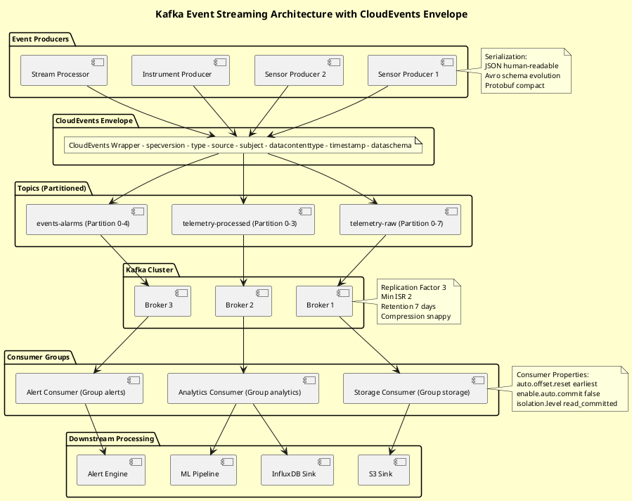
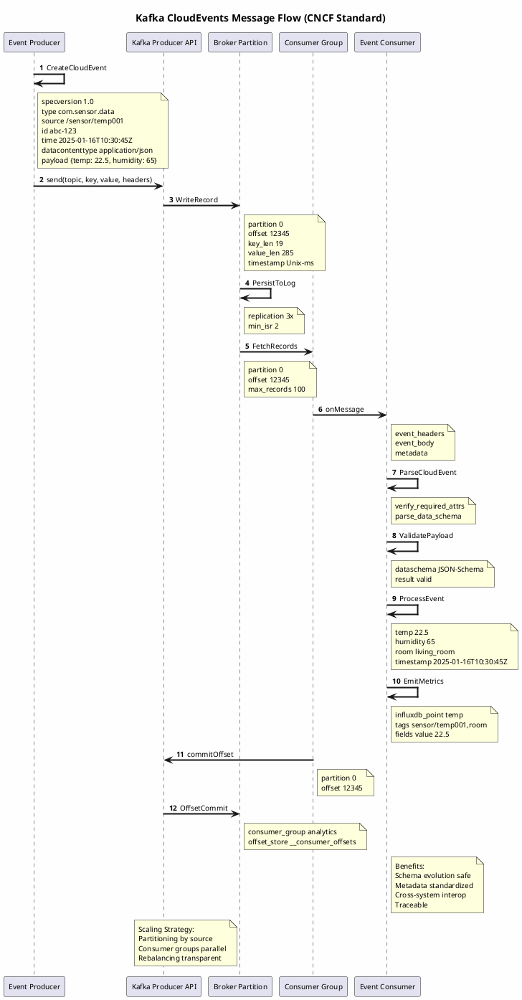

# Kafka Event Streaming with CloudEvents Integration Guide

## Overview
Implement event-driven telemetry using Kafka and CloudEvents CNCF standard for inter-service communication and data integration.

## Architecture
```
Telemetry Sources
    ↓
CloudEvents Wrapper
    ↓
Kafka Cluster (Topics)
    ↓
Consumer Groups (Analytics, Storage, Alerts)
```

## Setup
1. Install Kafka: `docker-compose up kafka zookeeper`
2. Create topics: `kafka-topics.sh --create --topic telemetry`
3. Run producer: `python examples/python/kafka-telemetry/kafka_producer.py`

## CloudEvents Benefits
- **Standardized envelopes**: Metadata and data separation
- **Schema evolution**: Add fields without breaking consumers
- **Distributed tracing**: W3C Trace Context propagation
- **Cross-system interoperability**: Cloud-native standards

## Configuration
```yaml
kafka:
  bootstrap_servers: ["localhost:9092"]
  topic: "telemetry"
producer:
  acks: 1
  compression: "snappy"
```

## Consumer Example
```python
consumer = KafkaConsumer('telemetry', bootstrap_servers=['localhost:9092'])
for msg in consumer:
    event = json.loads(msg.value())
    print(f"Event: {event['type']} from {event['source']}")
```

## Diagrams

### Event Streaming Architecture



### CloudEvents Message Flow (CNCF Standard)



## References
- Code: `examples/python/kafka-telemetry/`
- CloudEvents Spec: https://cloudevents.io/

---
Created: 2026-01-16
