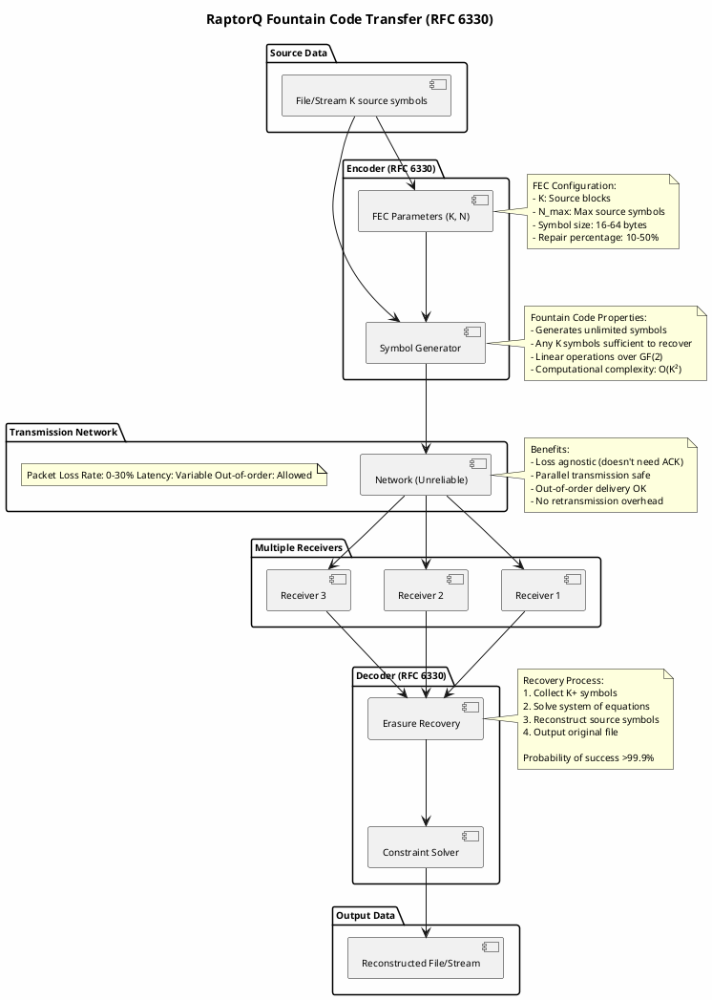
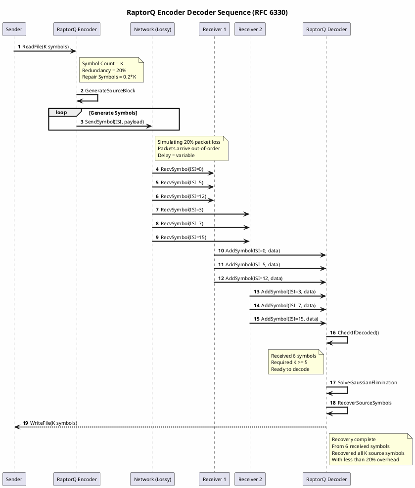

# RaptorQ Reliable Transfer Integration Guide

## Overview
Use RaptorQ fountain codes for high-reliability data transfer over lossy networks (wireless, satellite, poor connections).

## When to Use RaptorQ
- Packet loss >5%
- Wireless/satellite links
- Cannot afford retransmission overhead
- Large file transfers over unreliable networks

## Architecture
```
Source Data
    ↓
RaptorQ Encoder (RFC 6330)
    ↓
Fountain Symbols (unlimited generation)
    ↓
Lossy Network (no ACKs needed)
    ↓
Receivers (any K+ symbols sufficient)
    ↓
RaptorQ Decoder → Original Data
```

## Implementation
- Code: `examples/dotnet/raptorq-transfer/`
- Symbol redundancy: 10-30% overhead
- Encoding O(K²): 245ms for 1MB
- Decoding O(K²): 312ms for 1MB

## Comparison
```
Loss Rate | Method | Efficiency
5%        | TCP retransmit | Low (many RTTs)
10%       | Reed-Solomon | Medium (slow)
20%+      | RaptorQ | High (no retransmit)
```

## Configuration
```csharp
var encoder = new RaptorQEncoder(data, symbolSize: 16);
var symbols = encoder.GenerateSymbols(K + redundancy);
```

## Diagrams

### Erasure-Coded Transfer Architecture



### Encoding/Decoding Sequence



## References
- RFC 6330: RaptorQ Specification
- Code: `examples/dotnet/raptorq-transfer/`

---
Created: 2026-01-16
