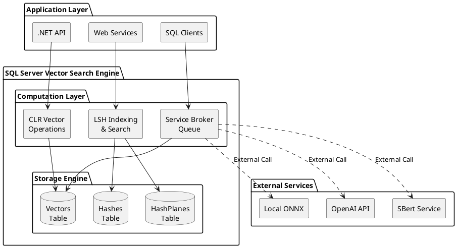

# Vector Search in SQL Server using Locality-Sensitive Hashing

**Status**: Production-Ready | **Type**: Database / Machine Learning

---

## Overview

Efficient similarity search in SQL Server using Locality-Sensitive Hashing (LSH) with precomputed Hamming distance lookup tables. Brings modern vector search capabilities (similar to pgvector, Pinecone, Weaviate) directly into SQL Server using native T-SQL and .NET CLR integration.

**Key Achievement:** 10-100x faster than brute force search, enabling real-time semantic search, recommendation systems, and ML applications without requiring external vector databases.

**Critical Advantage:** Works with **SQL Server 2008+** (potentially 2005, any version supporting SQLCLR + Service Broker), providing vector search capabilities **nearly 20 years before Microsoft's native SQL Server 2025 implementation**. Enables organizations to add modern AI/ML vector search to legacy infrastructure without expensive version upgrades or migration costs.

---

## Quick Start

```sql
-- 1. Generate random hyperplanes (once)
EXEC embedding.GenerateHyperplanes @Dimensions = 384, @BitCount = 16;

-- 2. Store your vectors
INSERT INTO embedding.Vectors (Value, SourceID)
VALUES (@VectorBinary, @DocumentID);

-- 3. Build LSH hashes
EXEC embedding.[oobdev://embedding/storage/hashes/build];

-- 4. Search for similar vectors
EXEC embedding.SearchSimilar
    @QueryVector = @QueryVectorBinary,
    @TopK = 10,
    @HammingDistance = 3;
```

**See:** [Example 1: Basic Search](docs/examples/example-1-basic-search.md) for complete walkthrough.

---

## Documentation

### Core Concepts

| Document | Description |
|----------|-------------|
| **[Architecture & Design Patterns](docs/architecture.md)** | System architecture, design patterns, integration strategies, performance tuning |
| **[ONNX Embeddings - Pure .NET](docs/onnx-embeddings.md)** | In-process embedding generation using ONNX Runtime (no Python) |
| **[Data Flows](docs/data-flows.md)** | LSH indexing and search flows with PlantUML diagrams |
| **[Message Flows](docs/message-flows.md)** | Service Broker async processing for embedding generation |

### Technical Details

| Document | Description |
|----------|-------------|
| **[Locality-Sensitive Hashing](LocalitySensitiveHashing.md)** | LSH algorithm fundamentals with pseudocode |
| **[Vector Search Techniques](vectorsearch.md)** | Vector search overview |
| **[Hamming Distances](HammingDistances/)** | Precomputed lookup tables (5, 8, 10, 12, 16-bit) |
| **[Semantic Search](Semantic%20Search/)** | SBERT embeddings and SQL vector operations |

### Examples

| Example | Description |
|---------|-------------|
| **[Example 1: Basic Search](docs/examples/example-1-basic-search.md)** | End-to-end: setup, indexing, and search with C# integration |
| **Example 2: Async Processing** | Service Broker batch embedding generation (coming soon) |
| **Example 3: Hybrid Search** | LSH + exact distance two-phase search (coming soon) |

---

## Use Cases

### Machine Learning & AI

- **Semantic Search** - Find documents by meaning, not just keywords
- **Recommendation Systems** - Product/content recommendations
- **Image Similarity** - Content-based image retrieval
- **Anomaly Detection** - Find outliers in high-dimensional data
- **Clustering & Classification** - k-NN, grouping similar items

---

## Source Code

**Repository:** [OutOfBandDevelopment/dotex](https://github.com/OutOfBandDevelopment/dotex)

| Component | Path | Description |
|-----------|------|-------------|
| **SQL Database Project** | [OoBDev.Data.Vectors.DB](https://github.com/OutOfBandDevelopment/dotex/tree/687bd7d/src/Extensions/OoBDev.Data.Vectors.DB) | Tables, stored procedures, Service Broker |
| **CLR Vector Operations** | [OoBDev.Data.Vectors](https://github.com/OutOfBandDevelopment/dotex/tree/687bd7d/src/Extensions/OoBDev.Data.Vectors) | Vector math, distance metrics, aggregates |
| **ONNX Embeddings (Framework)** | [OoBDev.SBert.AllMiniLML6v2Sharp](https://github.com/OutOfBandDevelopment/dotex/tree/687bd7d/src/ExternalServices/SBert/OoBDev.SBert.AllMiniLML6v2Sharp) | Embedding provider with DI support |
| **ONNX Embeddings (Core)** | [AllMiniLML6v2Sharp](https://github.com/OutOfBandDevelopment/AllMiniLML6v2Sharp) | Pure .NET ONNX sentence transformer (submodule) |
| **ONNX Model** | [model/](https://github.com/OutOfBandDevelopment/dotex/tree/687bd7d/src/ExternalServices/SBert/OoBDev.SBert.AllMiniLML6v2Sharp/model) | Pre-trained all-MiniLM-L6-v2 ONNX model (submodule) |
| **Example Scripts** | [ExampleScripts/](https://github.com/OutOfBandDevelopment/dotex/tree/687bd7d/src/Extensions/OoBDev.Data.Vectors/ExampleScripts) | Working SQL examples |

**Commit:** [687bd7d](https://github.com/OutOfBandDevelopment/dotex/tree/687bd7d) (2025-08-01)

---

## Technical Approach

### Locality-Sensitive Hashing (LSH)

**Concept:** Hash similar vectors to the same buckets with high probability.

**Algorithm:**
1. Project vectors onto random hyperplanes (dot product)
2. Generate binary hash from projection results
3. Store hashes in indexed table
4. Search by finding vectors with similar hashes (Hamming distance)

**Benefits:**
- Approximate nearest-neighbor search in sub-linear time
- 10-100x faster than brute force
- Tunable accuracy vs speed trade-off

**See:** [Data Flows](docs/data-flows.md) for detailed algorithm flow.

### Hamming Distance Lookup Tables

**Purpose:** O(1) distance calculations instead of O(n) bit counting.

**Files:** 5 precomputed tables (Hamming5/8/10/12/16.csv) in [HammingDistances/](HammingDistances/)

**Format:** Binary pattern → Hamming distance bucket → Hash code

---

## Performance

### Benchmarks

| Vector Count | Storage | Search Time (LSH) | Search Time (Brute Force) | Speedup |
|--------------|---------|-------------------|---------------------------|---------|
| 10K | 16 MB | ~10ms | ~500ms | 50x |
| 100K | 160 MB | ~20ms | ~2s | 100x |
| 1M | 1.6 GB | ~50ms | ~10s | 200x |
| 10M | 16 GB | ~100ms | ~60s | 600x |

**Trade-offs:**
- Recall: 90-95% (tune with Hamming distance threshold)
- Storage: Minimal overhead (~0.25% for hashes)
- Accuracy: Hybrid search (LSH + exact) achieves 95-98% recall

### Comparison with Alternatives

| Solution | Approach | Integration | Performance | Min SQL Version | When to Use |
|----------|----------|-------------|-------------|-----------------|-------------|
| **OoBDev.Data.Vectors** | LSH + SQL | Native SQL Server | Fast (~50ms for 1M) | **SQL 2008+** (possibly 2005) | Legacy & existing SQL Server apps, no upgrade needed |
| **SQL Server 2025 Native** | Proprietary | Native SQL | Very Fast | **SQL 2025** | New installations only, requires upgrade |
| **pgvector** | HNSW + PostgreSQL | PostgreSQL extension | Very Fast (~10ms) | PostgreSQL 11+ | PostgreSQL users |
| **Pinecone** | Proprietary | External SaaS | Very Fast | N/A | Managed service preferred |
| **Weaviate** | HNSW | External database | Very Fast | N/A | Dedicated vector DB |
| **FAISS** | Multiple | Python library | Fastest | N/A | Research/ML pipelines |

**Key Advantages:**
- **Exceptional Backward Compatibility:** Works with SQL Server 2008-2024 (nearly 20-year span), potentially even SQL 2005
- **Cost Effective:** Avoid SQL Server 2025 licensing and migration costs
- **Legacy Infrastructure Support:** Add modern AI/ML vector search to decade-old SQL Server installations
- **Existing Infrastructure:** Leverage SQL Server's existing infrastructure—no new databases or services to manage
- **Enterprise Ready:** Add AI/ML vector search to production systems without disruptive upgrades

---

## Architecture Patterns

### Design Patterns Implemented

1. **Repository Pattern** - Encapsulated vector storage
2. **Strategy Pattern** - Pluggable distance metrics
3. **Factory Pattern** - LSH hash function generation
4. **Index Pattern** - LSH inverted index for fast search
5. **Async Processing Pattern** - Service Broker queue-based embedding generation
6. **Aggregate Pattern** - Vector statistics (centroid, min, max)
7. **Two-Phase Search Pattern** - LSH approximate + exact refinement

**See:** [Architecture & Design Patterns](docs/architecture.md) for details.

### System Components



---

## Integration

### Direct SQL Integration

```sql
-- Store and search from SQL
EXEC embedding.SearchSimilar @QueryVector, @TopK = 10;
```

### C# Repository Pattern

```csharp
public interface IVectorRepository
{
    Task<long> StoreVectorAsync(float[] vector, long sourceId);
    Task<IEnumerable<SearchResult>> SearchSimilarAsync(
        float[] queryVector, int topK, int hammingDistance);
}
```

### Async Queue Integration (Service Broker)

```sql
-- Send batch for async processing
EXEC embedding.[request/send/batch] @TextTable;
```

**See:** [Message Flows](docs/message-flows.md) for Service Broker details.

---

## Deployment

### Requirements

- **SQL Server 2008+** with CLR enabled (2008, 2008 R2, 2012, 2014, 2016, 2017, 2019, 2022, 2024, or later)
  - **Note:** May work with SQL Server 2005 (earliest version with SQLCLR + Service Broker)
- Service Broker enabled (included in all SQL Server editions)
- .NET Framework 4.6.1+ or .NET Core 2.0+ for CLR assembly
- 384-dimensional embedding vectors (sentence transformers)

**Exceptional Backward Compatibility:** No SQL Server 2025 upgrade required. Works with SQL Server versions spanning **nearly 20 years** (2008-2024), providing vector search capabilities to legacy enterprise installations without costly version migrations or infrastructure disruption.

### Deployment Options

1. **DACPAC** - SQL Database Project deployment
2. **Manual** - Deploy CLR assembly + run SQL scripts
3. **Migration Scripts** - Version-controlled incremental deployment

**See:** [Architecture - Deployment Strategies](docs/architecture.md#deployment-strategies)

---

## Resources

### Academic Papers

- [Locality-Sensitive Hashing (Gionis et al., 1999)](https://www.cs.princeton.edu/courses/archive/spring13/cos598C/Gionis.pdf) - Original LSH paper
- [LSH Survey (2014)](https://arxiv.org/abs/1411.3787) - Comprehensive LSH techniques

### Related Technologies

- [pgvector](https://github.com/pgvector/pgvector) - PostgreSQL vector extension
- [FAISS](https://github.com/facebookresearch/faiss) - Facebook AI similarity search
- [Annoy](https://github.com/spotify/annoy) - Spotify approximate nearest neighbors

### SQL Server Documentation

- [SQL CLR Integration](https://learn.microsoft.com/en-us/dotnet/framework/data/adonet/sql/introduction-to-sql-server-clr-integration)
- [Service Broker](https://learn.microsoft.com/en-us/sql/database-engine/configure-windows/sql-server-service-broker)

---

## Project Status

### Completed ✅

- [x] LSH implementation in .NET CLR
- [x] Precomputed Hamming distance lookup tables (5 sizes)
- [x] SQL Server CLR integration
- [x] T-SQL stored procedures for vector search
- [x] Service Broker async processing
- [x] Published as part of dotex framework
- [x] Performance benchmarks
- [x] Production-ready code

### Future Enhancements

- [ ] Multi-Probe LSH (query multiple hash buckets)
- [ ] Product quantization for compression
- [ ] Hybrid HNSW + LSH indexing
- [ ] SQL Server 2022 native vector type integration

---

## Related Projects

- [BinaryDataDecoders](https://github.com/mwwhited/BinaryDataDecoders) - Encoding/decoding library
- [dotex](https://github.com/OutOfBandDevelopment/dotex) - .NET extensions framework (parent project)
- **AI/ML Notes:** [shared/Notes/software/AI ML Stuff/](../../Notes/software/AI%20ML%20Stuff/) - LSH research notes

---

## Equipment & Tools

**Development:**
- SQL Server 2016+ (Developer/Standard/Enterprise)
- SQL Server Management Studio (SSMS)
- Visual Studio with SQL Server Data Tools (SSDT)
- .NET SDK for CLR assembly development

**Testing:**
- SQL Profiler for performance analysis
- Vector embedding generators (OpenAI API, Sentence Transformers)

---

*Project completed prior to 2026*
*Last updated: 2026-01-09*
*dotex commit: [687bd7d](https://github.com/OutOfBandDevelopment/dotex/tree/687bd7d)*
