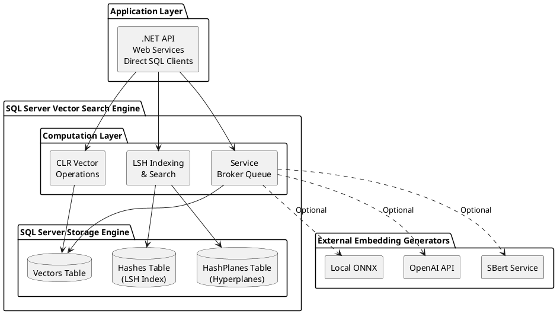
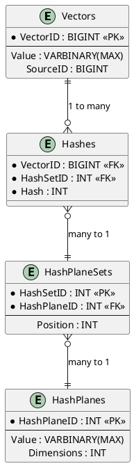

# Vector Search SQL Server - Architecture & Design Patterns

**Part of:** [Vector Search in SQL Server](../README.md)

## Overview

This document describes the architectural design patterns, system components, and integration strategies for implementing vector search in SQL Server using Locality-Sensitive Hashing (LSH).

## System Architecture

### High-Level Components



### Component Layers

#### 1. Storage Layer
- **Vectors Table** - Stores high-dimensional embedding vectors
- **Hashes Table** - LSH hash codes for fast lookup
- **HashPlanes Table** - Random hyperplanes for LSH projection
- **HashPlaneSets Table** - Grouping of hyperplanes for multi-hash strategies

#### 2. Computation Layer (CLR Functions)
- **Vector Mathematics** - Dot product, cosine similarity, Euclidean distance
- **Matrix Operations** - Vector/matrix conversions, aggregations
- **Hash Generation** - LSH hash computation from vectors
- **Hamming Distance** - Fast distance calculation using lookup tables

#### 3. Indexing Layer (Stored Procedures)
- **Hash Building** - Generate LSH hashes for all vectors
- **Hyperplane Generation** - Create random projection planes
- **Index Maintenance** - Incremental updates, rebuilds

#### 4. Query Layer (Search Operations)
- **Approximate Search** - Fast LSH-based candidate retrieval
- **Exact Refinement** - Re-rank candidates using exact distances
- **Hybrid Search** - Combined approximate + exact search

#### 5. Async Processing Layer (Service Broker)
- **Request Queue** - Async embedding generation requests
- **Response Queue** - Completed embedding results
- **Message Contracts** - Typed message definitions
- **Activation Procedures** - Automatic queue processing

## Design Patterns

### 1. Repository Pattern (Data Access)

**Purpose:** Encapsulate vector storage and retrieval logic.

**Implementation:**
- Vectors stored in dedicated `embedding.Vectors` table
- CLR types provide strongly-typed vector access
- Stored procedures abstract CRUD operations

**Benefits:**
- Clean separation between data access and business logic
- Consistent interface for vector operations
- Easy to swap implementations or add caching

**Source Code:**
- [embedding.Vectors Table](https://github.com/OutOfBandDevelopment/dotex/blob/687bd7d/src/Extensions/OoBDev.Data.Vectors.DB/Tables/embedding.Vectors.sql)
- [SqlVector CLR Type](https://github.com/OutOfBandDevelopment/dotex/blob/687bd7d/src/Extensions/OoBDev.Data.Vectors/SqlVector.cs)

### 2. Strategy Pattern (Distance Metrics)

**Purpose:** Allow pluggable distance calculation strategies.

**Implementation:**
```csharp
// Different distance strategies
public interface IDistanceMetric
{
    double Calculate(float[] vector1, float[] vector2);
}

// Implementations:
// - CosineDistance
// - EuclideanDistance
// - HammingDistance
// - DotProduct
```

**Benefits:**
- Easily switch distance metrics based on use case
- Add new metrics without modifying existing code
- Performance optimization per metric type

**Source Code:**
- [Vector Operations](https://github.com/OutOfBandDevelopment/dotex/blob/687bd7d/src/Extensions/OoBDev.Data.Vectors/SqlVector.cs)

### 3. Factory Pattern (Hash Generation)

**Purpose:** Create LSH hash functions with different configurations.

**Implementation:**
- Hash plane sets define configurations (bit length, count)
- Factory generates hyperplanes with specified dimensions
- Consistent hash generation across all vectors

**Benefits:**
- Configurable hash strategies (8-bit, 16-bit, 32-bit hashes)
- Reproducible hash generation
- Easy A/B testing of different LSH configurations

**Source Code:**
- [HashPlaneSets Table](https://github.com/OutOfBandDevelopment/dotex/blob/687bd7d/src/Extensions/OoBDev.Data.Vectors.DB/Tables/embedding.HashPlaneSets.sql)
- [HashPlanes Table](https://github.com/OutOfBandDevelopment/dotex/blob/687bd7d/src/Extensions/OoBDev.Data.Vectors.DB/Tables/embedding.HashPlanes.sql)

### 4. Index Pattern (LSH Inverted Index)

**Purpose:** Fast approximate nearest-neighbor search using hash-based indexing.

**Implementation:**
```sql
-- Hashes table acts as inverted index
CREATE TABLE embedding.Hashes (
    VectorID BIGINT NOT NULL,
    Hash INT NOT NULL,
    HashSetID INT NOT NULL,
    INDEX IX_Hashes_HashSet_Hash (HashSetID, Hash)
);
```

**Search Process:**
1. Compute query vector hash
2. Look up vectors with matching/similar hashes (index seek)
3. Retrieve candidate vectors (small subset)
4. Compute exact distances on candidates only

**Benefits:**
- O(1) hash lookup vs O(n) brute force
- Reduced computation (only compute distance for candidates)
- Tunable accuracy vs speed trade-off

**Source Code:**
- [Hashes Table](https://github.com/OutOfBandDevelopment/dotex/blob/687bd7d/src/Extensions/OoBDev.Data.Vectors.DB/Tables/embedding.Hashes.sql)
- [Hash Build Procedure](https://github.com/OutOfBandDevelopment/dotex/blob/687bd7d/src/Extensions/OoBDev.Data.Vectors.DB/Programmability/Stored%20Procedures/EmbeddingStorageHashesBuild.sql)

### 5. Async Processing Pattern (Service Broker)

**Purpose:** Decouple embedding generation from storage and search.

**Implementation:**
- Service Broker queues for async message processing
- Request/response message contracts
- Automatic activation procedures

**Flow:**
```
Application → Send Request → Queue → Activation → External Service → Response → Queue → Storage
```

**Benefits:**
- Non-blocking embedding generation
- Batch processing for efficiency
- Resilient to external service failures
- Automatic retry and poison message handling

**Source Code:**
- [Service Broker Queue](https://github.com/OutOfBandDevelopment/dotex/blob/687bd7d/src/Extensions/OoBDev.Data.Vectors.DB/ServiceBroker/Queues/EmbeddingSentenceTransformerQueue.sql)
- [Request Send Procedure](https://github.com/OutOfBandDevelopment/dotex/blob/687bd7d/src/Extensions/OoBDev.Data.Vectors.DB/Programmability/Stored%20Procedures/EmbeddingSentenceTransformerRequestSend.sql)
- [Response Send Procedure](https://github.com/OutOfBandDevelopment/dotex/blob/687bd7d/src/Extensions/OoBDev.Data.Vectors.DB/Programmability/Stored%20Procedures/EmbeddingSentenceTransformerResponseSend.sql)

### 6. Aggregate Pattern (Vector Statistics)

**Purpose:** Compute statistics over vector collections (centroid, min, max).

**Implementation:**
- CLR aggregates for vector operations
- SQL aggregates for standard operations

**Example:**
```sql
-- Compute centroid of vector collection
SELECT embedding.CentroidF(Vector) AS Centroid
FROM embedding.Vectors
WHERE CategoryID = 42;
```

**Benefits:**
- Efficient bulk operations
- Statistical analysis of embeddings
- Cluster analysis support

**Source Code:**
- [CentroidAggregate CLR](https://github.com/OutOfBandDevelopment/dotex/blob/687bd7d/src/Extensions/OoBDev.Data.Vectors/CentroidAggregate.cs)
- [MinimumAggregate CLR](https://github.com/OutOfBandDevelopment/dotex/blob/687bd7d/src/Extensions/OoBDev.Data.Vectors/MinimumAggregate.cs)
- [MaximumAggregate CLR](https://github.com/OutOfBandDevelopment/dotex/blob/687bd7d/src/Extensions/OoBDev.Data.Vectors/MaximumAggregate.cs)

### 7. Two-Phase Search Pattern (Hybrid Search)

**Purpose:** Combine fast approximate search with accurate exact search.

**Implementation:**
```
Phase 1 (Fast): LSH → Candidate Set (e.g., 1000 vectors)
Phase 2 (Accurate): Exact Distance → Top-K Results (e.g., 10 vectors)
```

**Benefits:**
- Best of both worlds: speed + accuracy
- Configurable candidate set size
- Fallback to brute force for small datasets

**See:** [Example 3 - Hybrid Search](examples/example-3-hybrid-search.md)

## Data Model

### Core Tables

```sql
-- Vector storage
embedding.Vectors (
    VectorID BIGINT PRIMARY KEY,
    Value VARBINARY(MAX),  -- Vector as binary
    SourceID BIGINT,       -- Optional: link to source data
    CreatedDate DATETIME
)

-- LSH hash index
embedding.Hashes (
    VectorID BIGINT,       -- FK to Vectors
    Hash INT,              -- LSH hash code
    HashSetID INT,         -- FK to HashPlaneSets
    INDEX (HashSetID, Hash)
)

-- Random hyperplanes for LSH
embedding.HashPlanes (
    HashPlaneID INT PRIMARY KEY,
    Value VARBINARY(MAX),  -- Random vector (hyperplane normal)
    Dimensions INT
)

-- Hash configuration sets
embedding.HashPlaneSets (
    HashSetID INT PRIMARY KEY,
    HashPlaneID INT,       -- FK to HashPlanes
    Position INT           -- Bit position in hash
)
```

### Relationships



## Integration Patterns

### Pattern 1: Direct SQL Integration

**Use Case:** Existing SQL Server application

**Approach:**
- Call stored procedures directly from application
- Use CLR types for vector operations
- Leverage existing connection pooling

**Example:**
```csharp
using (var connection = new SqlConnection(connectionString))
{
    var command = new SqlCommand("[embedding].[SearchSimilar]", connection);
    command.CommandType = CommandType.StoredProcedure;
    command.Parameters.AddWithValue("@QueryVector", vectorBytes);
    command.Parameters.AddWithValue("@TopK", 10);

    var results = command.ExecuteReader();
    // Process results...
}
```

### Pattern 2: Repository + Service Layer

**Use Case:** Clean architecture .NET application

**Approach:**
- Repository layer wraps SQL operations
- Service layer contains business logic
- DTOs for data transfer

**Example:**
```csharp
public interface IVectorRepository
{
    Task<long> StoreVectorAsync(float[] vector, long sourceId);
    Task<IEnumerable<VectorSearchResult>> SearchSimilarAsync(
        float[] queryVector, int topK, int hammingDistance = 4);
}

public class VectorSearchService
{
    private readonly IVectorRepository _repository;
    private readonly IEmbeddingGenerator _embeddingGenerator;

    public async Task<IEnumerable<SearchResult>> SearchByTextAsync(
        string query, int topK)
    {
        var vector = await _embeddingGenerator.GenerateAsync(query);
        var results = await _repository.SearchSimilarAsync(vector, topK);
        return MapToSearchResults(results);
    }
}
```

### Pattern 3: Async Queue Integration

**Use Case:** High-volume embedding generation

**Approach:**
- Send text to Service Broker queue
- External service processes requests
- Polling or callback for results

**See:** [Message Flows](message-flows.md) for detailed async patterns.

## Performance Considerations

### Index Tuning

**Hash Table Index:**
```sql
-- Primary index for hash lookups
CREATE NONCLUSTERED INDEX IX_Hashes_HashSet_Hash
    ON embedding.Hashes (HashSetID, Hash)
    INCLUDE (VectorID);
```

**Benefit:** Index seek instead of scan for candidate retrieval.

### Batch Operations

**Hash Building:**
- Build hashes in batches (e.g., 10,000 vectors at a time)
- Use set-based operations (avoid cursors/loops)
- Run during off-peak hours for large datasets

**Example:**
```sql
-- Batch hash building
WHILE EXISTS (
    SELECT TOP 1 *
    FROM embedding.Vectors v
    WHERE NOT EXISTS (
        SELECT * FROM embedding.Hashes h
        WHERE h.VectorID = v.VectorID
    )
)
BEGIN
    EXEC embedding.[oobdev://embedding/storage/hashes/build];
END
```

### Memory Optimization

**CLR Vector Types:**
- Store vectors as `VARBINARY(MAX)` for compact storage
- Deserialize only when needed for computation
- Use float (32-bit) instead of double (64-bit) when precision allows

**Hamming Lookup Tables:**
- Precomputed tables loaded into memory
- O(1) distance calculation
- Trade memory for CPU time

## Deployment Strategies

### Strategy 1: SQL CLR Assembly Deployment

1. Build CLR assembly (`OoBDev.Data.Vectors.dll`)
2. Deploy to SQL Server:
```sql
CREATE ASSEMBLY [OoBDev.Data.Vectors]
FROM 'C:\path\to\OoBDev.Data.Vectors.dll'
WITH PERMISSION_SET = SAFE;
```
3. Create CLR functions/types
4. Deploy stored procedures

### Strategy 2: DACPAC Deployment

1. Build SQL Database Project
2. Generate DACPAC file
3. Deploy using SqlPackage.exe:
```bash
sqlpackage /Action:Publish \
    /SourceFile:VectorSearch.dacpac \
    /TargetConnectionString:"Server=...;Database=..."
```

### Strategy 3: Migration Scripts

1. Version-controlled SQL scripts
2. Sequential deployment (V1, V2, V3, ...)
3. Idempotent scripts (IF NOT EXISTS checks)

## Monitoring & Observability

### Key Metrics

**Performance:**
- Average search latency (target: <100ms)
- Hash lookup time vs exact distance time
- Candidate set size (too large → slow, too small → low recall)

**Accuracy:**
- Recall @ K (% of true nearest neighbors found)
- Precision @ K
- Compare LSH results vs brute force ground truth

**System Health:**
- Service Broker queue depth
- Failed message count
- Vector table growth rate
- Hash table fragmentation

### Monitoring Queries

```sql
-- Search performance
SELECT
    AVG(SearchDurationMs) AS AvgSearchMs,
    AVG(CandidateCount) AS AvgCandidates,
    AVG(ResultCount) AS AvgResults
FROM SearchMetrics
WHERE SearchDate >= DATEADD(hour, -1, GETDATE());

-- Service Broker queue health
SELECT
    q.name AS QueueName,
    COUNT(*) AS MessageCount,
    MIN(queuing_order) AS OldestMessage
FROM sys.transmission_queue tq
INNER JOIN sys.service_queues q ON tq.to_service_name = q.name
GROUP BY q.name;
```

## Security Considerations

### CLR Assembly Security

**Permission Sets:**
- **SAFE** - No external resource access (recommended)
- **EXTERNAL_ACCESS** - File system, network access
- **UNSAFE** - Unrestricted access (avoid)

**Recommendation:** Use SAFE permission set for vector operations.

### SQL Injection Protection

**Always use parameterized queries:**
```csharp
// Good
var command = new SqlCommand(
    "EXEC embedding.SearchSimilar @Vector, @TopK", connection);
command.Parameters.AddWithValue("@Vector", vectorBytes);
command.Parameters.AddWithValue("@TopK", topK);

// Bad - SQL injection risk
var command = new SqlCommand(
    $"EXEC embedding.SearchSimilar '{vectorString}', {topK}", connection);
```

### Access Control

**Schema-based security:**
```sql
-- Create schema for isolation
CREATE SCHEMA embedding AUTHORIZATION dbo;

-- Grant permissions
GRANT SELECT, EXECUTE ON SCHEMA::embedding TO [VectorSearchAppRole];
```

## Scalability Patterns

### Horizontal Partitioning

**Partition by HashSetID:**
```sql
CREATE PARTITION FUNCTION HashSetPartitionFunc (INT)
AS RANGE RIGHT FOR VALUES (1, 2, 3, 4);

CREATE PARTITION SCHEME HashSetPartitionScheme
AS PARTITION HashSetPartitionFunc ALL TO ([PRIMARY]);

CREATE TABLE embedding.Hashes (
    VectorID BIGINT,
    Hash INT,
    HashSetID INT
) ON HashSetPartitionScheme(HashSetID);
```

**Benefits:**
- Parallel query execution
- Partition elimination
- Easier maintenance (rebuild by partition)

### Read Replicas

**Use Always On Availability Groups:**
- Primary for writes (embedding storage, hash building)
- Read replicas for search queries
- Automatic failover for high availability

### Caching Strategy

**Application-level caching:**
- Cache frequent queries (query text → results)
- Cache embedding vectors (text → vector)
- Use Redis or in-memory cache
- TTL based on data freshness requirements

## Related Documents

- [Data Flows](data-flows.md) - LSH indexing and search data flows
- [Message Flows](message-flows.md) - Service Broker async processing
- [SQL Implementation](sql-implementation.md) - Complete SQL code reference
- [C# Implementation](csharp-implementation.md) - CLR types and operations
- [Examples](examples/) - Working code examples

## External References

**Source Code:**
- [dotex GitHub Repository](https://github.com/OutOfBandDevelopment/dotex)
- [OoBDev.Data.Vectors](https://github.com/OutOfBandDevelopment/dotex/tree/687bd7d/src/Extensions/OoBDev.Data.Vectors)
- [OoBDev.Data.Vectors.DB](https://github.com/OutOfBandDevelopment/dotex/tree/687bd7d/src/Extensions/OoBDev.Data.Vectors.DB)

**Academic Papers:**
- [LSH Original Paper (Gionis et al., 1999)](https://www.cs.princeton.edu/courses/archive/spring13/cos598C/Gionis.pdf)
- [LSH Survey (2014)](https://arxiv.org/abs/1411.3787)

**Related Technologies:**
- [pgvector](https://github.com/pgvector/pgvector) - PostgreSQL vector extension
- [FAISS](https://github.com/facebookresearch/faiss) - Facebook AI similarity search
- [Annoy](https://github.com/spotify/annoy) - Spotify approximate nearest neighbors

---

*Last updated: 2026-01-09*
*dotex commit: 687bd7d*
