# Vector Search SQL Server - Data Flows

**Part of:** [Vector Search in SQL Server](../README.md)

## Overview

This document illustrates the data flows for LSH-based vector search in SQL Server, including indexing (hash building) and search operations.

## Flow 1: Vector Ingestion & LSH Hash Building

### High-Level Flow


### Detailed Steps

#### Step 1: Store Embedding Vector

**Input:** High-dimensional vector (e.g., 384-dimensional float array from sentence transformer)

**SQL:**
```sql
INSERT INTO embedding.Vectors (Value, SourceID, CreatedDate)
VALUES (@VectorBinary, @SourceID, GETDATE());

SELECT SCOPE_IDENTITY() AS VectorID;
```

**Data Format:**

```plantuml
@startuml
skinparam defaultTextAlignment center
skinparam ActivityBackgroundColor #FAFAFA

start
:Vector\n[0.123, -0.456, 0.789, ..., 0.234]\n(384 floats);
note right
  384 float values
end note

:Binary Conversion\n0x3e3...\n(1536 bytes = 384 × 4 bytes/float);
note right
  Each float = 4 bytes
end note

:Storage\nVARBINARY(MAX)\nin Vectors.Value column;

stop
@enduml
```



**Source:** [embedding.Vectors Table](https://github.com/OutOfBandDevelopment/dotex/blob/687bd7d/src/Extensions/OoBDev.Data.Vectors.DB/Tables/embedding.Vectors.sql)

#### Step 2: Load Hash Planes (Hyperplanes)

**Query:**
```sql
SELECT
    hp.HashPlaneID,
    hp.Value,  -- Random vector (hyperplane normal)
    hps.Position  -- Bit position in hash
FROM embedding.HashPlaneSets hps
INNER JOIN embedding.HashPlanes hp
    ON hp.HashPlaneID = hps.HashPlaneID
WHERE hps.HashSetID = @HashSetID
ORDER BY hps.Position;
```

**Hyperplane Structure:**

| Position | Vector (384 dimensions) |
|----------|------------------------|
| 0 | [0.234, -0.567, 0.890, ..., 0.123] |
| 1 | [-0.456, 0.789, -0.123, ..., 0.456] |
| 2 | [0.678, -0.234, 0.567, ..., -0.789] |
| ... | ... |
| 15 | [-0.890, 0.345, -0.678, ..., 0.234] |

_HashSetID=1 with 16 hyperplanes (16-bit hash)_

**Source:** [embedding.HashPlanes Table](https://github.com/OutOfBandDevelopment/dotex/blob/687bd7d/src/Extensions/OoBDev.Data.Vectors.DB/Tables/embedding.HashPlanes.sql)

#### Step 3: Compute LSH Hash

**Algorithm:**
```sql
-- For each hyperplane:
--   1. Compute dot product with vector
--   2. If result > 0, set bit at position
--   3. Sum bit values to create hash

SELECT
    v.VectorID,
    hps.HashSetID,
    SUM(CASE
        WHEN hp.Value.DotProduct(v.Value) < 0 THEN 0
        ELSE POWER(2, hps.Position-1)
    END) AS Hash
FROM embedding.Vectors v
CROSS JOIN embedding.HashPlaneSets hps
INNER JOIN embedding.HashPlanes hp
    ON hp.HashPlaneID = hps.HashPlaneID
WHERE v.VectorID = @VectorID
    AND hps.HashSetID = @HashSetID
GROUP BY v.VectorID, hps.HashSetID;
```

**Example Calculation (16-bit hash):**
```
Vector: [0.5, -0.3, 0.8, ..., 0.2]

Hyperplane 0: DotProduct = +0.234 → Bit 0 = 1 → Value = 2^0 = 1
Hyperplane 1: DotProduct = -0.156 → Bit 1 = 0 → Value = 0
Hyperplane 2: DotProduct = +0.891 → Bit 2 = 1 → Value = 2^2 = 4
...
Hyperplane 15: DotProduct = +0.345 → Bit 15 = 1 → Value = 2^15 = 32768

Hash = 1 + 0 + 4 + ... + 32768 = 45321 (example)
```

**Source:** [EmbeddingStorageHashesBuild.sql](https://github.com/OutOfBandDevelopment/dotex/blob/687bd7d/src/Extensions/OoBDev.Data.Vectors.DB/Programmability/Stored%20Procedures/EmbeddingStorageHashesBuild.sql)

#### Step 4: Store Hash in Index

**Insert:**
```sql
INSERT INTO embedding.Hashes (VectorID, Hash, HashSetID)
VALUES (@VectorID, @Hash, @HashSetID);
```

**Index Structure:**

**Hashes Table:**

| VectorID | Hash  | HashSetID | Note |
|----------|-------|-----------|------|
| 1 | 45321 | 1 | |
| 2 | 12345 | 1 | |
| 3 | 45322 | 1 | Similar hash to Vector 1 |
| 4 | 67890 | 1 | |
| ... | ... | ... | |

**Index:** `(HashSetID, Hash)` - Fast lookup

**Source:** [embedding.Hashes Table](https://github.com/OutOfBandDevelopment/dotex/blob/687bd7d/src/Extensions/OoBDev.Data.Vectors.DB/Tables/embedding.Hashes.sql)

### Batch Hash Building


**Stored Procedure:**
```sql
EXEC embedding.[oobdev://embedding/storage/hashes/build];
```

This procedure processes all unhashed vectors in a single set-based operation (no cursors).

**Source:** [EmbeddingStorageHashesBuild.sql](https://github.com/OutOfBandDevelopment/dotex/blob/687bd7d/src/Extensions/OoBDev.Data.Vectors.DB/Programmability/Stored%20Procedures/EmbeddingStorageHashesBuild.sql)

---

## Flow 2: Vector Search (LSH-Based)

### High-Level Flow


### Detailed Steps

#### Step 1: Compute Query Vector Hash

**Input:** Query vector from application

```sql
DECLARE @QueryVector embedding.VectorF = '0.5,-0.3,0.8,...,0.2';
DECLARE @HashSetID INT = 1;

-- Compute hash using same hyperplanes
DECLARE @QueryHash INT;

SELECT @QueryHash = SUM(
    CASE
        WHEN hp.Value.DotProduct(@QueryVector) < 0 THEN 0
        ELSE POWER(2, hps.Position-1)
    END)
FROM embedding.HashPlaneSets hps
INNER JOIN embedding.HashPlanes hp
    ON hp.HashPlaneID = hps.HashPlaneID
WHERE hps.HashSetID = @HashSetID;

-- Result: @QueryHash = 45320 (example)
```

#### Step 2: Expand Hash with Hamming Distance

**Generate Similar Hashes:**

Hamming distance of 2 means hashes that differ by at most 2 bits.

```
Query Hash: 45321 = 1011000100001001 (binary)

Hamming Distance 0: [45321]
Hamming Distance 1: [45320, 45323, 45317, ...]  (flip 1 bit)
Hamming Distance 2: [45322, 45324, ...]          (flip 2 bits)
```

**SQL Using Lookup Tables:**
```sql
-- Precomputed Hamming distance lookup table
SELECT DISTINCT h.Hash
FROM embedding.HammingDistances hd
INNER JOIN embedding.Hashes h
    ON h.Hash BETWEEN (hd.MinHash) AND (hd.MaxHash)
WHERE hd.BaseHash = @QueryHash
    AND hd.Distance <= @MaxHammingDistance
    AND h.HashSetID = @HashSetID;
```

**Alternative (Bit Manipulation):**
```sql
-- Generate hashes within Hamming distance threshold
-- (Simplified - actual implementation uses lookup tables)
SELECT Hash
FROM embedding.Hashes
WHERE HashSetID = @HashSetID
    AND dbo.HammingDistance(Hash, @QueryHash) <= @MaxHammingDistance;
```

**Hamming Distance Calculation:**
```
Hash1: 45321 = 1011000100001001
Hash2: 45322 = 1011000100001010
XOR:           0000000000000011  (2 bits differ)
PopCount:      2

Hamming Distance = 2
```

**Source:** [Hamming Distance Lookup Tables](../HammingDistances/)

#### Step 3: Retrieve Candidate Vectors

**Index Seek:**
```sql
SELECT DISTINCT h.VectorID
FROM embedding.Hashes h
INNER JOIN @SimilarHashes sh
    ON sh.Hash = h.Hash
WHERE h.HashSetID = @HashSetID;
```

**Index Usage:**


#### Step 4: Compute Exact Distances

**Retrieve Vectors & Calculate Distance:**
```sql
SELECT TOP (@TopK)
    v.VectorID,
    v.SourceID,
    v.Value.CosineSimilarity(@QueryVector) AS Similarity,
    1 - v.Value.CosineSimilarity(@QueryVector) AS Distance
FROM embedding.Vectors v
WHERE v.VectorID IN (SELECT VectorID FROM @Candidates)
ORDER BY Distance ASC;
```

**Distance Metrics:**

**Cosine Similarity:**
```
similarity = (A · B) / (||A|| × ||B||)
distance = 1 - similarity
```

**Euclidean Distance:**
```
distance = sqrt(Σ(Ai - Bi)²)
```

**Source:** [SqlVector.cs - CLR Methods](https://github.com/OutOfBandDevelopment/dotex/blob/687bd7d/src/Extensions/OoBDev.Data.Vectors/SqlVector.cs)

#### Step 5: Return Top-K Results

**Final Output:**
```sql
VectorID | SourceID | Similarity | Distance
---------|----------|------------|----------
   3     |   102    |   0.987    |  0.013
   7     |   205    |   0.945    |  0.055
   12    |   309    |   0.923    |  0.077
  ...    |   ...    |   ...      |  ...
```

### Performance Breakdown


---

## Flow 3: Hybrid Search (Two-Phase)

### Overview

Combine LSH approximate search (fast) with exact distance refinement (accurate).


### SQL Implementation

```sql
-- Phase 1: LSH approximate search (fast)
WITH Candidates AS (
    SELECT DISTINCT h.VectorID
    FROM embedding.Hashes h
    WHERE h.HashSetID = @HashSetID
        AND h.Hash IN (
            -- Similar hashes (Hamming distance)
            SELECT Hash
            FROM dbo.GetSimilarHashes(@QueryHash, @MaxHammingDistance)
        )
)
-- Phase 2: Exact distance refinement (accurate)
SELECT TOP (@TopK)
    v.VectorID,
    v.SourceID,
    v.Value.CosineSimilarity(@QueryVector) AS Similarity
FROM embedding.Vectors v
INNER JOIN Candidates c ON c.VectorID = v.VectorID
ORDER BY Similarity DESC;
```

### Trade-offs

| Metric | LSH Only | Hybrid (LSH + Exact) | Brute Force |
|--------|----------|----------------------|-------------|
| **Speed** | ⚡⚡⚡ Fastest (~20ms) | ⚡⚡ Fast (~88ms) | 🐢 Slow (~5-10s) |
| **Accuracy** | 📊 Good (85-90% recall) | 📊📊📊 Excellent (95-98% recall) | 📊📊📊 Perfect (100%) |
| **Candidate Set** | N/A (returns hash matches) | 100-1000 vectors | All vectors |
| **Use Case** | High-volume, tolerant to misses | Production, balanced | Small datasets, ground truth |

**Recommendation:** Use hybrid search for production workloads.

---

## Flow 4: Batch Embedding Generation (Async)

### Async Processing with Service Broker


**See:** [Message Flows](message-flows.md) for detailed Service Broker implementation.

---

## Flow 5: Incremental Hash Updates

### Adding New Vectors


### Rebuilding Hashes (Maintenance)

**When to Rebuild:**
- Hyperplanes changed (different LSH configuration)
- Hash corruption detected
- Performance degradation (fragmentation)

**Procedure:**
```sql
-- Option 1: Full rebuild
TRUNCATE TABLE embedding.Hashes;
EXEC embedding.[oobdev://embedding/storage/hashes/build];

-- Option 2: Incremental (only unhashed)
EXEC embedding.[oobdev://embedding/storage/hashes/build];
```

---

## Data Size & Growth

### Storage Estimates

**Per Vector (384 dimensions):**
```
Vector storage: 384 floats × 4 bytes = 1,536 bytes
Hash storage: 1 INT (16-bit hash) = 4 bytes
Overhead: ~100 bytes (row overhead, indexes)

Total per vector: ~1,640 bytes
```

**1 Million Vectors:**
```
Vectors table: 1M × 1,536 bytes ≈ 1.5 GB
Hashes table: 1M × 4 bytes ≈ 4 MB
Indexes: ~500 MB

Total: ~2 GB for 1M vectors
```

### Scaling Characteristics

| Vector Count | Storage | Index Build Time | Search Time (Avg) |
|--------------|---------|------------------|-------------------|
| 10K | ~16 MB | ~1 second | ~10ms |
| 100K | ~160 MB | ~10 seconds | ~20ms |
| 1M | ~1.6 GB | ~2 minutes | ~50ms |
| 10M | ~16 GB | ~20 minutes | ~100ms |
| 100M | ~160 GB | ~3 hours | ~200ms |

**Note:** Times are approximate and depend on hardware, configuration, and Hamming distance threshold.

---

## Monitoring Data Flows

### Key Metrics to Track

**Ingestion:**
- Vectors/second inserted
- Hash build latency
- Hash build queue depth

**Search:**
- Queries/second
- Average search latency (p50, p95, p99)
- Candidate set size distribution
- Recall rate (if ground truth available)

**System:**
- Hashes table size
- Index fragmentation
- Service Broker queue depth

### Monitoring Queries

```sql
-- Vector ingestion rate
SELECT
    DATEDIFF(minute, MIN(CreatedDate), MAX(CreatedDate)) AS Minutes,
    COUNT(*) AS TotalVectors,
    COUNT(*) / DATEDIFF(minute, MIN(CreatedDate), MAX(CreatedDate)) AS VectorsPerMinute
FROM embedding.Vectors
WHERE CreatedDate >= DATEADD(hour, -1, GETDATE());

-- Unhashed vectors (indexing backlog)
SELECT COUNT(*) AS UnhashedVectors
FROM embedding.Vectors v
WHERE NOT EXISTS (
    SELECT * FROM embedding.Hashes h
    WHERE h.VectorID = v.VectorID
);

-- Hash distribution (should be relatively uniform)
SELECT
    Hash,
    COUNT(*) AS VectorCount
FROM embedding.Hashes
WHERE HashSetID = 1
GROUP BY Hash
ORDER BY VectorCount DESC;
```

---

## Related Documents

- [Architecture & Design Patterns](architecture.md) - System design and patterns
- [Message Flows](message-flows.md) - Service Broker async processing
- [SQL Implementation](sql-implementation.md) - Complete SQL code
- [Examples](examples/) - Working code examples

## External References

**Source Code:**
- [OoBDev.Data.Vectors.DB](https://github.com/OutOfBandDevelopment/dotex/tree/687bd7d/src/Extensions/OoBDev.Data.Vectors.DB)
- [Stored Procedures](https://github.com/OutOfBandDevelopment/dotex/tree/687bd7d/src/Extensions/OoBDev.Data.Vectors.DB/Programmability/Stored%20Procedures)
- [Tables](https://github.com/OutOfBandDevelopment/dotex/tree/687bd7d/src/Extensions/OoBDev.Data.Vectors.DB/Tables)

---

*Last updated: 2026-01-09*
*dotex commit: 687bd7d*
