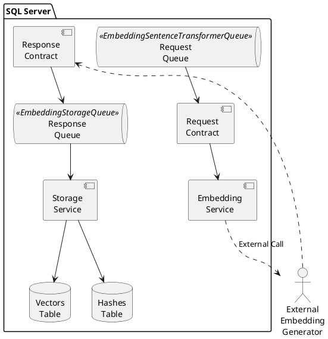
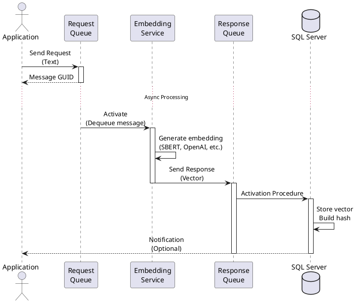
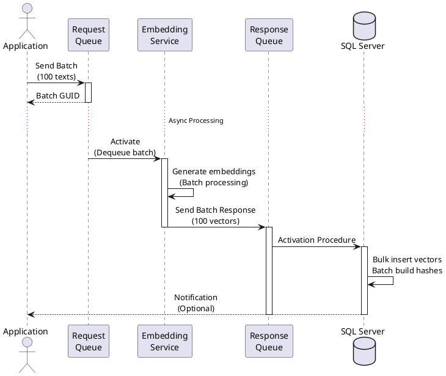
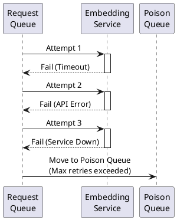
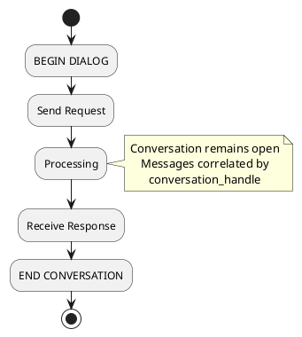

# Vector Search SQL Server - Message Flows (Service Broker)

**Part of:** [Vector Search in SQL Server](../README.md)

## Overview

SQL Server Service Broker enables asynchronous, queue-based processing for embedding generation. This allows decoupling of embedding generation from vector storage and search operations.

## Architecture

### Service Broker Components



**Source Code:**
- [Service Broker Queues](https://github.com/OutOfBandDevelopment/dotex/tree/687bd7d/src/Extensions/OoBDev.Data.Vectors.DB/ServiceBroker/Queues)
- [Service Broker Services](https://github.com/OutOfBandDevelopment/dotex/tree/687bd7d/src/Extensions/OoBDev.Data.Vectors.DB/ServiceBroker/Services)
- [Message Contracts](https://github.com/OutOfBandDevelopment/dotex/tree/687bd7d/src/Extensions/OoBDev.Data.Vectors.DB/ServiceBroker/Contracts)

---

## Message Flow 1: Single Embedding Request

### Sequence Diagram



### Step-by-Step

#### 1. Application Sends Request

**SQL Procedure:**
```sql
EXEC embedding.[oobdev://embedding/sentence-transformer/request/send]
    @Text = 'The quick brown fox jumps over the lazy dog',
    @SourceID = 12345,
    @ConversationHandle = @ConversationGUID OUTPUT;
```

**Message Format:**
```xml
<EmbeddingRequest>
    <Text>The quick brown fox jumps over the lazy dog</Text>
    <SourceID>12345</SourceID>
    <ConversationHandle>GUID-HERE</ConversationHandle>
</EmbeddingRequest>
```

**Source:** [EmbeddingSentenceTransformerRequestSend.sql](https://github.com/OutOfBandDevelopment/dotex/blob/687bd7d/src/Extensions/OoBDev.Data.Vectors.DB/Programmability/Stored%20Procedures/EmbeddingSentenceTransformerRequestSend.sql)

#### 2. External Service Processes Request

**Pseudo-code:**
```python
# External service polls queue
while True:
    message = sql_server.receive_message('EmbeddingSentenceTransformerQueue')

    if message:
        text = message['Text']
        source_id = message['SourceID']
        conversation = message['ConversationHandle']

        # Generate embedding (e.g., SBert)
        vector = generate_embedding(text)  # Returns float[384]

        # Send response back
        sql_server.send_response(
            conversation_handle=conversation,
            vector=vector,
            source_id=source_id
        )
```

#### 3. Response Queue Receives Embedding

**Activation Procedure (Automatic):**
```sql
-- Triggered automatically when message arrives
CREATE PROCEDURE embedding.ResponseQueueActivation
AS
BEGIN
    DECLARE @ConversationHandle UNIQUEIDENTIFIER;
    DECLARE @MessageBody VARBINARY(MAX);
    DECLARE @Vector embedding.VectorF;
    DECLARE @SourceID BIGINT;

    -- Receive from queue
    RECEIVE TOP(1)
        @ConversationHandle = conversation_handle,
        @MessageBody = message_body
    FROM EmbeddingStorageQueue;

    -- Parse message (XML)
    SELECT
        @Vector = MessageXML.value('(/EmbeddingResponse/Vector)[1]', 'embedding.VectorF'),
        @SourceID = MessageXML.value('(/EmbeddingResponse/SourceID)[1]', 'BIGINT')
    FROM OPENJSON(@MessageBody);

    -- Store vector
    INSERT INTO embedding.Vectors (Value, SourceID, CreatedDate)
    VALUES (@Vector, @SourceID, GETDATE());

    -- Build hash
    EXEC embedding.[oobdev://embedding/storage/hashes/build];

    -- End conversation
    END CONVERSATION @ConversationHandle;
END
```

**Source:** [Service Broker Queue Activation](https://github.com/OutOfBandDevelopment/dotex/tree/687bd7d/src/Extensions/OoBDev.Data.Vectors.DB/ServiceBroker)

---

## Message Flow 2: Batch Embedding Request

### Sequence Diagram



### Batch Processing Benefits

**Single Request:**
- Latency: ~500ms per request
- Throughput: ~2 requests/second
- Total time for 100 texts: ~50 seconds

**Batch Request (100 texts):**
- Latency: ~5 seconds per batch
- Throughput: ~20 texts/second
- Total time for 100 texts: ~5 seconds

**Performance Improvement: 10x**

### SQL Procedure

```sql
-- Send batch request
EXEC embedding.[oobdev://embedding/sentence-transformer/request/send/batch]
    @Texts = @TextTable,  -- Table-valued parameter
    @ConversationHandle = @ConversationGUID OUTPUT;
```

**Table-Valued Parameter:**
```sql
DECLARE @TextTable embedding.EmbeddingSentenceTransformerRequestSendBatchSet;

INSERT INTO @TextTable (SourceID, Text)
VALUES
    (1, 'First document text'),
    (2, 'Second document text'),
    (3, 'Third document text'),
    ...
    (100, 'Hundredth document text');
```

**Source:** [EmbeddingSentenceTransformerRequestSendBatch.sql](https://github.com/OutOfBandDevelopment/dotex/blob/687bd7d/src/Extensions/OoBDev.Data.Vectors.DB/Programmability/Stored%20Procedures/EmbeddingSentenceTransformerRequestSendBatch.sql)

---

## Message Flow 3: Error Handling

### Retry Logic



### Poison Message Handling

**Configuration:**
```sql
ALTER QUEUE EmbeddingSentenceTransformerQueue
WITH
    STATUS = ON,
    RETENTION = OFF,
    ACTIVATION (
        STATUS = ON,
        PROCEDURE_NAME = embedding.RequestQueueActivation,
        MAX_QUEUE_READERS = 5,
        EXECUTE AS OWNER
    ),
    POISON_MESSAGE_HANDLING (
        STATUS = ON,
        MAX_RECEIVE_ATTEMPTS = 3
    );
```

**Monitoring:**
```sql
-- Check poison messages
SELECT
    conversation_handle,
    message_type_name,
    message_body,
    queuing_order,
    CAST(message_body AS NVARCHAR(MAX)) AS MessageText
FROM sys.transmission_queue
WHERE to_service_name = 'EmbeddingSentenceTransformer'
    AND transmission_status <> '';
```

---

## Message Flow 4: Conversation Management

### Conversation Lifecycle



### Conversation Groups

**Purpose:** Group related conversations for transactional processing.

**Example:**
```sql
-- Start conversation with group
BEGIN DIALOG CONVERSATION @ConversationHandle
FROM SERVICE [EmbeddingClient]
TO SERVICE 'EmbeddingSentenceTransformer'
ON CONTRACT [EmbeddingSentenceTransformerContract]
WITH ENCRYPTION = OFF,
     RELATED_CONVERSATION_GROUP = @ConversationGroup;
```

**Benefits:**
- Process related messages together
- Maintain ordering within group
- Transactional consistency

---

## Performance Tuning

### Queue Readers

**Configuration:**
```sql
ALTER QUEUE EmbeddingSentenceTransformerQueue
WITH ACTIVATION (
    MAX_QUEUE_READERS = 10  -- Parallel processing
);
```

**Guidelines:**
- 1 reader: Sequential processing
- 5-10 readers: Balanced parallelism
- 20+ readers: High throughput (if external service can handle)

### Batch Size

**Trade-offs:**

| Batch Size | Latency | Throughput | Memory | Recommended For |
|------------|---------|------------|--------|-----------------|
| 1 | Low (~500ms) | Low (~2/s) | Low | Real-time |
| 10 | Medium (~1s) | Medium (~10/s) | Medium | Interactive |
| 100 | High (~5s) | High (~20/s) | Medium | Background |
| 1000 | Very High (~30s) | Very High (~30/s) | High | Bulk import |

**Recommendation:** Use batch size 50-100 for balanced performance.

### Message Size Limits

**Service Broker Limits:**
- Max message size: 2GB (configurable)
- Recommended: <1MB per message
- Large payloads: Use external storage + reference

**Vector Message Size:**
```
384-dimensional vector:
- Float array: 384 × 4 bytes = 1,536 bytes
- XML overhead: ~500 bytes
- Total: ~2KB per vector

Batch of 100 vectors: ~200KB (well under limit)
```

---

## Monitoring & Diagnostics

### Queue Depth

```sql
SELECT
    q.name AS QueueName,
    COUNT(*) AS MessageCount,
    MIN(queuing_order) AS OldestMessage,
    MAX(queuing_order) AS NewestMessage
FROM sys.transmission_queue tq
INNER JOIN sys.service_queues q
    ON tq.to_service_name = q.name
GROUP BY q.name;
```

### Conversation Status

```sql
SELECT
    conversation_handle,
    state_desc,
    lifetime,
    DATEDIFF(second, GETDATE(), lifetime) AS SecondsRemaining
FROM sys.conversation_endpoints
WHERE state_desc <> 'CLOSED';
```

### Failed Messages

```sql
SELECT
    conversation_handle,
    transmission_status,
    from_service_name,
    to_service_name,
    message_body
FROM sys.transmission_queue
WHERE transmission_status <> ''
ORDER BY queuing_order;
```

---

## Related Documents

- [Architecture](architecture.md) - Design patterns including Async Processing Pattern
- [Data Flows](data-flows.md) - Flow 4: Batch Embedding Generation
- [SQL Implementation](sql-implementation.md) - Complete SQL code
- [Example 2](examples/example-2-async-processing.md) - Working async example

## External References

**Source Code:**
- [Service Broker Implementation](https://github.com/OutOfBandDevelopment/dotex/tree/687bd7d/src/Extensions/OoBDev.Data.Vectors.DB/ServiceBroker)
- [Request Procedures](https://github.com/OutOfBandDevelopment/dotex/tree/687bd7d/src/Extensions/OoBDev.Data.Vectors.DB/Programmability/Stored%20Procedures)

**Microsoft Documentation:**
- [Service Broker Overview](https://learn.microsoft.com/en-us/sql/database-engine/configure-windows/sql-server-service-broker)
- [Service Broker Programming](https://learn.microsoft.com/en-us/previous-versions/sql/sql-server-2008-r2/bb522893(v=sql.105))

---

*Last updated: 2026-01-09*
*dotex commit: 687bd7d*
