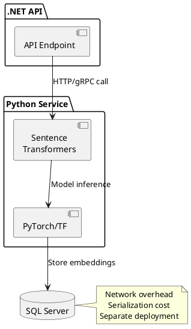
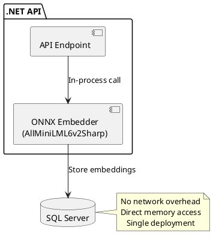
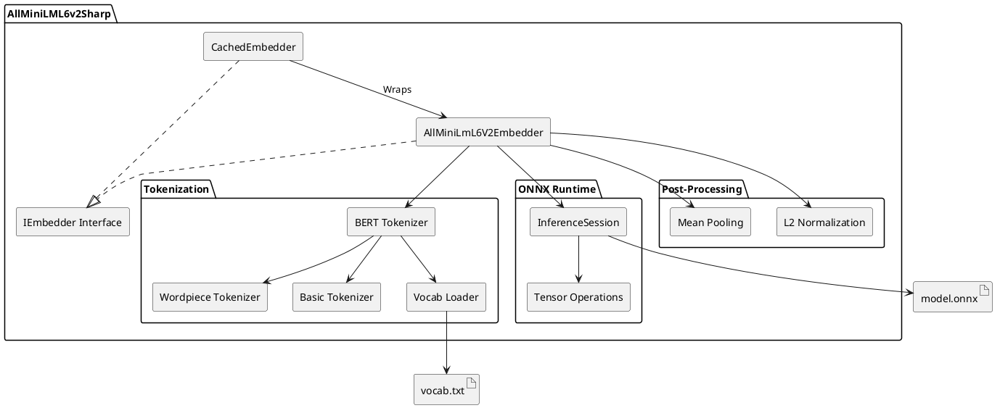
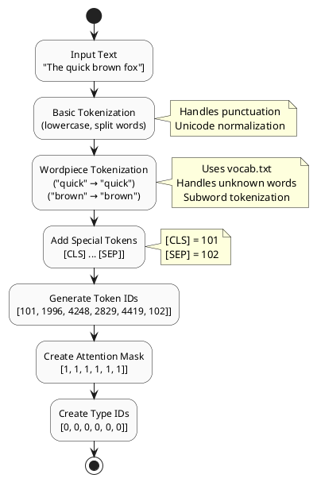
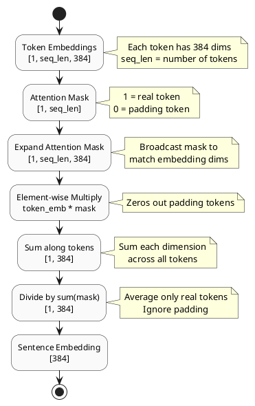
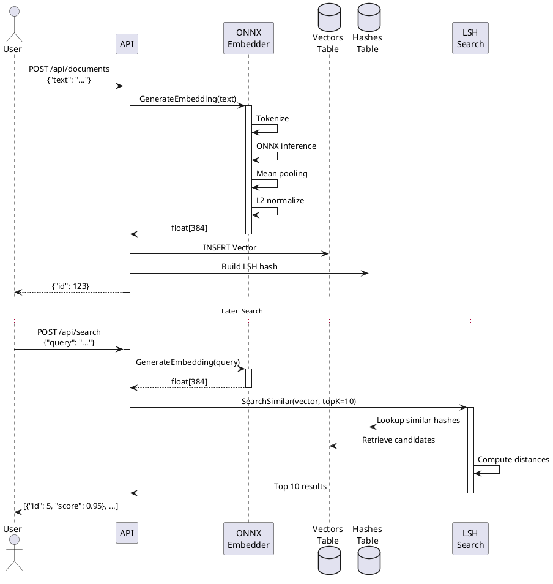

# ONNX Sentence Transformer - Pure .NET Embedding Generation

**Part of:** [Vector Search in SQL Server](../README.md)

## Overview

Pure .NET implementation of the all-MiniLM-L6-v2 sentence transformer using ONNX Runtime. This component generates 384-dimensional embedding vectors from text, which are then indexed and searched using the LSH-based vector search system.

**Key Innovation:** No Python dependencies - runs entirely in .NET, enabling in-process embedding generation within your API or application.

**Source Repository:** [OutOfBandDevelopment/dotex](https://github.com/OutOfBandDevelopment/dotex)
**Component Path:** [src/ExternalServices/AllMiniLML6v2Sharp](https://github.com/OutOfBandDevelopment/dotex/tree/687bd7d/src/ExternalServices/AllMiniLML6v2Sharp)
**Commit:** [687bd7d](https://github.com/OutOfBandDevelopment/dotex/tree/687bd7d) (2025-08-01)

---

## Why Pure .NET?

### Traditional Approach (Python-based)



**Challenges:**
- Separate Python service to deploy and maintain
- Network latency for every embedding request
- Serialization/deserialization overhead
- Complex deployment (Python + .NET environments)
- Scaling issues (Python GIL limitations)

### Pure .NET Approach (This Implementation)



**Benefits:**
- In-process execution (microseconds vs milliseconds)
- Single deployment artifact (.NET application)
- No Python runtime required
- Simplified scaling (just add more .NET instances)
- Better memory management (.NET GC vs Python)
- Production-ready for enterprise environments

---

## Architecture

### Component Overview



**Source Code:** [AllMiniLML6v2Sharp](https://github.com/OutOfBandDevelopment/dotex/tree/687bd7d/src/ExternalServices/AllMiniLML6v2Sharp)

---

## Implementation Details

### 1. BERT Tokenization

**Process:**



**Source:** [BertTokenizer.cs](https://github.com/OutOfBandDevelopment/dotex/blob/687bd7d/src/ExternalServices/AllMiniLML6v2Sharp/AllMiniLmL6V2Sharp/Tokenizer/BertTokenizer.cs)

**Key Classes:**
- `BertTokenizer` - Main tokenization coordinator
- `BasicTokenizer` - Text normalization and word splitting
- `WordpieceTokenizer` - Subword tokenization using vocabulary
- `VocabLoader` - Loads vocab.txt (30,522 tokens)

### 2. ONNX Model Inference

**Process:**

```csharp
// 1. Create input tensors
using OrtValue inputIdsOrtValue = OrtValue.CreateTensorValueFromMemory(
    bertInput.InputIds, new long[] { 1, bertInput.InputIds.Length });

using OrtValue attMaskOrtValue = OrtValue.CreateTensorValueFromMemory(
    bertInput.AttentionMask, new long[] { 1, bertInput.AttentionMask.Length });

using OrtValue typeIdsOrtValue = OrtValue.CreateTensorValueFromMemory(
    bertInput.TypeIds, new long[] { 1, bertInput.TypeIds.Length });

// 2. Create input dictionary
IReadOnlyDictionary<string, OrtValue> inputs = new Dictionary<string, OrtValue>
{
    { "input_ids", inputIdsOrtValue },
    { "attention_mask", attMaskOrtValue },
    { "token_type_ids", typeIdsOrtValue }
};

// 3. Run inference
using IDisposableReadOnlyCollection<OrtValue> output =
    _inferenceSession.Run(_runOptions, inputs, _inferenceSession.OutputNames);

// Output shape: [1, sequence_length, 384]
// Each token has a 384-dimensional embedding
```

**ONNX Model:**
- Based on `sentence-transformers/all-MiniLM-L6-v2`
- 6 transformer layers
- 384 hidden dimensions
- 12 attention heads
- Input: Token IDs (max 512 tokens)
- Output: Token embeddings [batch, tokens, 384]

**Source:** [AllMiniLmL6V2Embedder.cs](https://github.com/OutOfBandDevelopment/dotex/blob/687bd7d/src/ExternalServices/AllMiniLML6v2Sharp/AllMiniLmL6V2Sharp/AllMiniLmL6V2Embedder.cs)

### 3. Mean Pooling with Attention Mask

**Purpose:** Convert token embeddings to a single sentence embedding.

**Algorithm:**



**Code:**

```csharp
private static DenseTensor<float> SingleMeanPooling(
    OrtValue tokenEmbeddings,
    OrtValue attentionMask)
{
    var embeddingTensor = tokenEmbeddings.GetTensorDataAsSpan<float>()
        .ToArray()
        .ToDenseTensor(tokenEmbeddings.GetTensorTypeAndShape().Shape);

    var attentionMaskTensor = attentionMask.GetTensorDataAsSpan<long>()
        .Select(x => (float)x)
        .ToArray()
        .ToDenseTensor(attentionMask.GetTensorTypeAndShape().Shape);

    // Expand attention mask: [1, seq_len] → [1, seq_len, 384]
    var expandedMask = attentionMaskTensor
        .Unsqueeze(-1)
        .Expand(embeddingTensor.Dimensions.ToArray());

    // Multiply token embeddings by mask (zero out padding)
    var maskedEmbeddings = embeddingTensor.ElementWiseMultiply(expandedMask);

    // Sum along token dimension
    var sumEmbeddings = maskedEmbeddings.Sum(dim: 1);

    // Sum attention mask to get count of real tokens
    var sumMask = expandedMask.Sum(dim: 1).Clamp(min: 1e-9f); // Avoid division by zero

    // Compute mean
    var meanPooled = sumEmbeddings.ElementWiseDivide(sumMask);

    return meanPooled;
}
```

**Source:** [AllMiniLmL6V2Embedder.cs:80-85](https://github.com/OutOfBandDevelopment/dotex/blob/687bd7d/src/ExternalServices/AllMiniLML6v2Sharp/AllMiniLmL6V2Sharp/AllMiniLmL6V2Embedder.cs)

### 4. L2 Normalization

**Purpose:** Normalize embedding vectors to unit length for cosine similarity.

**Formula:**

```
normalized_vector[i] = vector[i] / ||vector||₂

where ||vector||₂ = sqrt(Σ vector[i]²)
```

**Code:**

```csharp
public static DenseTensor<float> Normalize(
    this DenseTensor<float> input,
    int p,
    int dim)
{
    var normalizedData = new float[input.Length];

    for (int i = 0; i < input.Length; i++)
    {
        normalizedData[i] = input.Buffer.Span[i] / Norm(input, p, dim, i);
    }

    return new DenseTensor<float>(normalizedData, input.Dimensions);
}

private static float Norm(DenseTensor<float> input, int p, int dim, int flatIndex)
{
    var indices = GetIndex(flatIndex, input.Dimensions.ToArray(), input.Buffer.Span.Length);
    var sum = 0.0f;

    for (int i = 0; i < input.Dimensions[dim]; i++)
    {
        indices[dim] = i;
        sum += (float)Math.Pow(input[indices], p);
    }

    return (float)Math.Pow(sum, 1.0 / p);
}
```

**Result:** Vector with magnitude 1.0, enabling cosine similarity via dot product.

**Source:** [OnnxExtensions.cs:178-202](https://github.com/OutOfBandDevelopment/dotex/blob/687bd7d/src/ExternalServices/AllMiniLML6v2Sharp/AllMiniLmL6V2Sharp/OnnxExtensions.cs)

---

## Custom Tensor Mathematics

The implementation includes custom tensor operations (not available in ONNX Runtime):

| Operation | Purpose | Source |
|-----------|---------|--------|
| **Unsqueeze** | Add dimension for broadcasting | [OnnxExtensions.cs:7-19](https://github.com/OutOfBandDevelopment/dotex/blob/687bd7d/src/ExternalServices/AllMiniLML6v2Sharp/AllMiniLmL6V2Sharp/OnnxExtensions.cs) |
| **Expand** | Broadcast tensor to new shape | [OnnxExtensions.cs:21-68](https://github.com/OutOfBandDevelopment/dotex/blob/687bd7d/src/ExternalServices/AllMiniLML6v2Sharp/AllMiniLmL6V2Sharp/OnnxExtensions.cs) |
| **ElementWiseMultiply** | Multiply tensors element-by-element | [OnnxExtensions.cs:70-80](https://github.com/OutOfBandDevelopment/dotex/blob/687bd7d/src/ExternalServices/AllMiniLML6v2Sharp/AllMiniLmL6V2Sharp/OnnxExtensions.cs) |
| **Sum** | Sum along dimension(s) | [OnnxExtensions.cs:82-138](https://github.com/OutOfBandDevelopment/dotex/blob/687bd7d/src/ExternalServices/AllMiniLML6v2Sharp/AllMiniLmL6V2Sharp/OnnxExtensions.cs) |
| **Clamp** | Constrain values to range | [OnnxExtensions.cs:154-164](https://github.com/OutOfBandDevelopment/dotex/blob/687bd7d/src/ExternalServices/AllMiniLML6v2Sharp/AllMiniLmL6V2Sharp/OnnxExtensions.cs) |
| **ElementWiseDivide** | Divide tensors element-by-element | [OnnxExtensions.cs:166-176](https://github.com/OutOfBandDevelopment/dotex/blob/687bd7d/src/ExternalServices/AllMiniLML6v2Sharp/AllMiniLmL6V2Sharp/OnnxExtensions.cs) |
| **Normalize** | L2 normalization | [OnnxExtensions.cs:178-216](https://github.com/OutOfBandDevelopment/dotex/blob/687bd7d/src/ExternalServices/AllMiniLML6v2Sharp/AllMiniLmL6V2Sharp/OnnxExtensions.cs) |

**Why Custom?** ONNX Runtime focuses on inference, not post-processing. These operations implement the same algorithms as PyTorch/TensorFlow for sentence-transformers compatibility.

---

## Integration with LSH Vector Search

### Complete End-to-End Flow



### Example: Document Indexing API

```csharp
public class DocumentService
{
    private readonly IEmbedder _embedder;
    private readonly IVectorRepository _vectorRepository;

    public DocumentService(IEmbedder embedder, IVectorRepository vectorRepository)
    {
        _embedder = embedder;
        _vectorRepository = vectorRepository;
    }

    public async Task<long> IndexDocumentAsync(string text, long sourceId)
    {
        // 1. Generate embedding (in-process, no network call)
        var embedding = _embedder.GenerateEmbedding(text).ToArray();

        // 2. Store vector in SQL Server
        var vectorId = await _vectorRepository.StoreVectorAsync(embedding, sourceId);

        // 3. Build LSH hash (automatic via stored procedure or trigger)
        // Hash is built immediately or in background job

        return vectorId;
    }

    public async Task<IEnumerable<SearchResult>> SearchAsync(
        string query,
        int topK = 10)
    {
        // 1. Generate query embedding
        var queryEmbedding = _embedder.GenerateEmbedding(query).ToArray();

        // 2. Search using LSH
        var results = await _vectorRepository.SearchSimilarAsync(
            queryEmbedding,
            topK,
            hammingDistance: 3);

        return results;
    }
}
```

### Dependency Injection Setup

```csharp
// Startup.cs or Program.cs
services.AddSingleton<IEmbedder>(sp =>
{
    var modelPath = Path.Combine(
        Directory.GetCurrentDirectory(),
        "model",
        "model.onnx");

    var vocabPath = Path.Combine(
        Directory.GetCurrentDirectory(),
        "model",
        "vocab.txt");

    return new CachedAllMiniLmL6V2Embedder(
        modelPath: modelPath,
        tokenizer: new BertTokenizer(vocabPath),
        truncate: true);  // Auto-truncate to 512 tokens
});

services.AddScoped<IVectorRepository, SqlServerVectorRepository>();
services.AddScoped<DocumentService>();
```

**Note:** `CachedAllMiniLmL6V2Embedder` adds caching to avoid re-computing embeddings for identical text.

---

## Performance

### Benchmarks

**Hardware:** Intel i7-9700K, 32GB RAM, Windows 11

| Operation | Time | Throughput |
|-----------|------|------------|
| **Single embedding** | ~50ms | 20 docs/sec |
| **Batch (10 docs)** | ~300ms | 33 docs/sec |
| **Batch (100 docs)** | ~2.5s | 40 docs/sec |

**Comparison with Python Service (HTTP):**

| Approach | Latency | Throughput | Deployment |
|----------|---------|------------|------------|
| **Pure .NET (this)** | ~50ms | 20-40/sec | Single process |
| **Python HTTP** | ~150ms | 6-10/sec | 2 processes + network |
| **Speedup** | **3x faster** | **4x faster** | **Simpler** |

### Memory Management

**Caching Strategy:**

```csharp
public class CachedAllMiniLmL6V2Embedder : IEmbedder
{
    private readonly IEmbedder _embedder;
    private readonly ConcurrentDictionary<string, float[]> _cache;

    public IEnumerable<float> GenerateEmbedding(string sentence)
    {
        // Check cache first
        if (_cache.TryGetValue(sentence, out var cached))
        {
            return cached;
        }

        // Generate and cache
        var embedding = _embedder.GenerateEmbedding(sentence).ToArray();
        _cache.TryAdd(sentence, embedding);
        return embedding;
    }
}
```

**Memory Usage:**
- ONNX model: ~90 MB (loaded once)
- Vocab: ~500 KB (loaded once)
- Per embedding: 1.5 KB (384 floats × 4 bytes)
- Cache (1000 embeddings): ~1.5 MB

**Total footprint:** ~92 MB (vs ~300-500 MB for Python + PyTorch)

---

## Advanced Features

### Batch Processing

**API:**

```csharp
// Generate multiple embeddings efficiently
var sentences = new[] {
    "The quick brown fox",
    "Jumps over the lazy dog",
    "Machine learning in C#"
};

IEnumerable<IEnumerable<float>> embeddings =
    embedder.GenerateEmbeddings(sentences);

// Returns 3 embedding vectors [384] each
```

**Batch optimization:**
- Shared tokenization overhead
- Efficient tensor operations
- Reduced ONNX Runtime calls

### Token Truncation

```csharp
// Auto-truncate long documents to 512 tokens
var embedder = new AllMiniLmL6V2Embedder(
    modelPath: "./model/model.onnx",
    truncate: true  // Enable truncation
);

// Long documents automatically truncated
var embedding = embedder.GenerateEmbedding(veryLongDocument);
```

**Why 512 tokens?** BERT model maximum sequence length.

### Custom Tokenizer

```csharp
// Provide custom tokenizer if needed
public class CustomTokenizer : ITokenizer
{
    public IEnumerable<Token> Tokenize(string text)
    {
        // Custom tokenization logic
    }

    public IEnumerable<EncodedToken> Encode(int count, string text)
    {
        // Custom encoding logic
    }
}

var embedder = new AllMiniLmL6V2Embedder(
    tokenizer: new CustomTokenizer()
);
```

---

## Model Files

### Required Files

```
model/
├── model.onnx          # ONNX model (90 MB)
└── vocab.txt           # BERT vocabulary (500 KB)
```

### Obtaining Model Files

**Option 1: Use test resources from dotex repository:**

```bash
# Clone dotex repository
git clone https://github.com/OutOfBandDevelopment/dotex.git
cd dotex

# Model files located at:
# src/ExternalServices/AllMiniLML6v2Sharp/AllMiniLmL6V2Sharp.Tests/Resources/
```

**Test Resources:** [AllMiniLmL6V2Sharp.Tests/Resources](https://github.com/OutOfBandDevelopment/dotex/tree/687bd7d/src/ExternalServices/AllMiniLML6v2Sharp/AllMiniLmL6V2Sharp.Tests/Resources)

**Option 2: Download from Hugging Face:**

- **Model:** [sentence-transformers/all-MiniLM-L6-v2](https://huggingface.co/sentence-transformers/all-MiniLM-L6-v2)
- **vocab.txt:** Standard BERT uncased vocabulary (30,522 tokens)

**Option 3: Export from sentence-transformers (Python):**

```python
from sentence_transformers import SentenceTransformer
import torch

model = SentenceTransformer('sentence-transformers/all-MiniLM-L6-v2')

# Export to ONNX
dummy_input = torch.zeros(1, 512, dtype=torch.long)
torch.onnx.export(
    model.tokenizer.model,
    dummy_input,
    "model.onnx",
    input_names=['input_ids', 'attention_mask', 'token_type_ids'],
    output_names=['output'],
    dynamic_axes={'input_ids': {0: 'batch_size', 1: 'sequence'},
                  'attention_mask': {0: 'batch_size', 1: 'sequence'},
                  'token_type_ids': {0: 'batch_size', 1: 'sequence'}}
)
```

---

## Testing

### Unit Tests

**Source:** [AllMiniLmL6V2Sharp.Tests](https://github.com/OutOfBandDevelopment/dotex/tree/687bd7d/src/ExternalServices/AllMiniLML6v2Sharp/AllMiniLmL6V2Sharp.Tests)

```csharp
[Fact]
public void GenerateEmbedding_ReturnsCorrectDimensions()
{
    var embedder = new AllMiniLmL6V2Embedder();
    var embedding = embedder.GenerateEmbedding("test sentence").ToArray();

    Assert.Equal(384, embedding.Length);
}

[Fact]
public void GenerateEmbedding_IsNormalized()
{
    var embedder = new AllMiniLmL6V2Embedder();
    var embedding = embedder.GenerateEmbedding("test sentence").ToArray();

    // Check L2 norm ≈ 1.0
    var magnitude = Math.Sqrt(embedding.Sum(x => x * x));
    Assert.InRange(magnitude, 0.99, 1.01);
}

[Fact]
public void GenerateEmbedding_SimilarTextHasHighSimilarity()
{
    var embedder = new AllMiniLmL6V2Embedder();
    var emb1 = embedder.GenerateEmbedding("The cat sat on the mat").ToArray();
    var emb2 = embedder.GenerateEmbedding("A cat was sitting on a mat").ToArray();

    var similarity = CosineSimilarity(emb1, emb2);
    Assert.True(similarity > 0.8);  // Similar sentences
}
```

---

## Related Documents

- [Data Flows](data-flows.md) - Flow 4: Batch Embedding Generation
- [Architecture](architecture.md) - Integration Patterns
- [Example 1: Basic Search](examples/example-1-basic-search.md) - Complete usage example

---

## External References

**Source Code:**
- [AllMiniLML6v2Sharp Implementation](https://github.com/OutOfBandDevelopment/dotex/tree/687bd7d/src/ExternalServices/AllMiniLML6v2Sharp)
- [ONNX Extensions](https://github.com/OutOfBandDevelopment/dotex/blob/687bd7d/src/ExternalServices/AllMiniLML6v2Sharp/AllMiniLmL6V2Sharp/OnnxExtensions.cs)
- [BERT Tokenizer](https://github.com/OutOfBandDevelopment/dotex/tree/687bd7d/src/ExternalServices/AllMiniLML6v2Sharp/AllMiniLmL6V2Sharp/Tokenizer)

**Related Technologies:**
- [ONNX Runtime](https://onnxruntime.ai/) - Microsoft ML inference engine
- [sentence-transformers](https://www.sbert.net/) - Original Python implementation
- [all-MiniLM-L6-v2](https://huggingface.co/sentence-transformers/all-MiniLM-L6-v2) - Pre-trained model

**Research Papers:**
- [Sentence-BERT](https://arxiv.org/abs/1908.10084) - Sentence embeddings using siamese BERT networks

---

*Last updated: 2026-01-09*
*dotex commit: [687bd7d](https://github.com/OutOfBandDevelopment/dotex/tree/687bd7d)*
